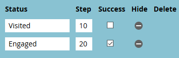

# Instellen [!UICONTROL Performance Insights] {#setting-up-performance-insights}

Voer de onderstaande stappen uit om MPI in te stellen.

## Opportunity instellen {#opportunity-setup}

1. Klik op **[!UICONTROL Admin]**.

   

1. Klik op **[!UICONTROL Revenue Cycle Analytics]**.

   

   >[!NOTE]
   >
   >Als u geen RCA hebt, moet u **[!UICONTROL Program Analysis]** selecteren voor Stap 2.

1. Klik onder Kenmerk op **[!UICONTROL Edit]** .

   

1. Attributie-instellingen worden weergegeven.

   

   Als de Attributie uitdrukkelijk is, zorg ervoor de Rol van het Contact van de Kans is bevolkt (of via het eindpunt van de Rol van de Kans of via de integratie van CRM).

   Als Attribution impliciet is, zorg ervoor het bedrijfgebied op lood/contact het zelfde als de Naam van de Rekening van de kans is.

   >[!NOTE]
   >
   >Zorg ervoor dat alle mogelijkheden de juiste velden hebben:
   >
   >* [!UICONTROL Opportunity Amount]
   >* [!UICONTROL Is Closed]
   >* [!UICONTROL Is Won]
   >* [!UICONTROL Creation Date] (dit wordt mogelijk niet ingesteld in uw geval)
   >* [!UICONTROL Closed Date] (dit wordt mogelijk niet ingesteld in uw geval)
   >* [!UICONTROL Opportunity Type]

## Programma instellen {#program-setup}

Werk de programmakosten ten minste 12 maanden bij. U kunt dit handmatig doen of de programma-API gebruiken. In dit voorbeeld doen we het handmatig.

1. Klik op **[!UICONTROL Marketing Activities]**.

   

1. Zoek en selecteer uw programma.

   

1. Klik op de tab **[!UICONTROL Setup]** .

   

1. Sleep **[!UICONTROL Period Cost]** naar het canvas.

   

1. Stel de programmamaand minstens 12 maanden geleden in en klik op **[!UICONTROL Ok]** .

   

1. Stel de kosten voor de periode in en klik op **[!UICONTROL Save]** .

   

Controleer vervolgens het analysegedrag om aan te geven of een bepaald kanaal moet worden opgenomen in de analyse. Stel het gedrag Analytics (Normaal, Inclusief, Operationeel) in.

1. Klik op **[!UICONTROL Admin]**.

   

1. Klik op **[!UICONTROL Tags]**.

   

1. Klik **+** om de lijst van het Kanaal uit te breiden.

   

1. Klik het gewenste kanaal tweemaal.

   

1. Klik op de vervolgkeuzelijst **[!UICONTROL Analytics Behavior]** en selecteer het gewenste gedrag.

   

1. Stel de succescriteria in.

   

1. Klik op **[!UICONTROL Save]**.

   

## Het programma aan de persoon overhandigen {#tie-the-program-to-the-person}

1. Zorg ervoor dat het overnameprogramma en de overnamedatum zijn ingesteld voor elke persoon in de database, zodat First Touch Attribution werkt.
1. Zorg ervoor dat uw programma&#39;s de status van succes instellen voor uw volk.

>[!NOTE]
>
>Wijzigingen worden niet onmiddellijk doorgevoerd. Een overnight-periode is vereist voordat wijzigingen van kracht worden.
