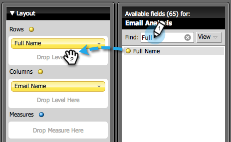

# Een e-mailanalyserapport maken waarin de leads {#build-an-email-analysis-report-that-lists-leads} worden weergegeven

>[!AVAILABILITY]
>
>Niet alle klanten hebben deze functionaliteit aangeschaft. Neem contact op met je verkoper voor meer informatie.

Voer de volgende stappen uit om een e-mailanalyserapport te maken waarin elke lead wordt weergegeven die een specifieke e-mail heeft verzonden. Dit rapport bevat ook de status Klik en Openen. 1. Start Revenue Explorer.

1. Klik **Nieuw Rapport**.

   

1. Selecteer het gebied E-mailanalyse en klik op **OK**.

   

1. Vind de gele punt van de Naam E-mail, klik het met de rechtermuisknop aan en selecteer **Filter**.

   

1. Dubbelklik in de lijst op de gewenste e-mail en klik op **OK**.

   

1. Sleep de gele punt van de Naam E-mail naar Kolommen.

   

   >[!TIP]
   >
   >Er zijn vele lood/bedrijfattributen die u als kolommen kunt toevoegen, controleer hen uit!

1. Zoek de gele stip Volledige naam en sleep deze naar Rijen.

   

1. Voeg nu de maatregelen toe u in door hen te tweemaal klikken geinteresseerd bent.

   

>[!NOTE]
>
>Afhankelijk van de hoeveelheid gegevens hebt u dit rapport hebt, kan het even duren om te vernieuwen.

Nu u klaar bent, moet uw verslag er ongeveer als volgt uitzien:

Opdracht voltooid!
