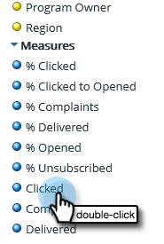

# Een e-mailanalyserapport maken waarin de leads worden vermeld {#build-an-email-analysis-report-that-lists-leads}

>[!AVAILABILITY]
>
>Niet alle klanten hebben deze functionaliteit aangeschaft. Neem voor meer informatie contact op met de succesmanager van de klant.

Voer de volgende stappen uit om een e-mailanalyserapport te maken waarin elke lead wordt weergegeven die een specifieke e-mail heeft verzonden. Dit rapport bevat ook de status Klik en Openen.

>[!NOTE]
>
>De gegevensengine die de RCA voor e-mailanalyse ondersteunt, negeert meer dan 12 klikken per persoon als deze afkomstig zijn van dezelfde e-mail en campagne. Hiermee houdt u rekening wanneer u e-mailanalyserapporten vergelijkt met standaard Marketo Analytics-rapporten.

1. Starten **Ontdekkingsreiziger voor inkomsten**.

   

1. Klikken **Nieuw maken** dan **Rapport**.

   

1. Selecteer E-mailanalyse en klik op **OK**.

   

1. De gele punt voor e-mailnamen zoeken, er met de rechtermuisknop op klikken en selecteren **Filter**.

   

1. Dubbelklik op het e-mailadres van uw keuze in de lijst en klik op **OK**.

   

1. Sleep de **E-mailnaam** gele stip op **Kolommen**.

   

   >[!TIP]
   >
   >Er zijn vele lood/bedrijfattributen die u als kolommen kunt toevoegen, controleer hen uit!

1. Zoek de **Volledige naam** gele stip en sleep deze naar **Rijen**.

   

1. Voeg nu de **Maatregelen** u bent geïnteresseerd door erop te dubbelklikken.

   

>[!NOTE]
>
>Afhankelijk van de hoeveelheid gegevens hebt u dit rapport hebt, kan het even duren om te vernieuwen.

Opdracht voltooid!
