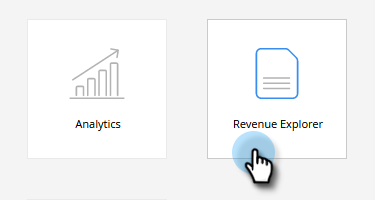
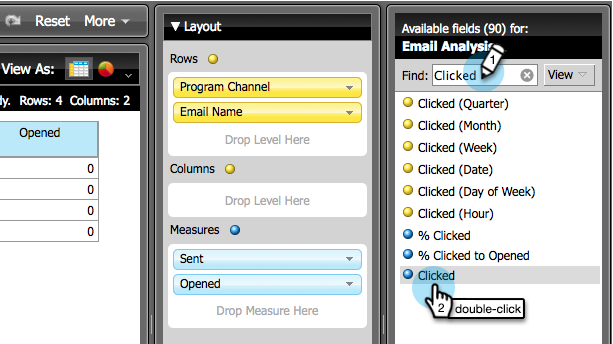

# Een e-mailanalyserapport maken waarin de programmagegevens worden weergegeven {#build-an-email-analysis-report-that-shows-program-information}

Ga als volgt te werk om een e-mailanalyserapport te maken waarin de e-mailgegevens worden gegroepeerd op programmakanalen.

>[!AVAILABILITY]
>
>Niet iedereen heeft deze functie aangeschaft. Neem contact op met het Adobe-accountteam (uw accountmanager) voor meer informatie.

1. Start **[!UICONTROL Revenue Explorer]** .

   

1. Klik op **[!UICONTROL Create New]** en selecteer **[!UICONTROL Report]** .

   

1. Selecteer **[!UICONTROL Email Analysis]** gebied en klik op **[!UICONTROL OK]** .

   

1. Zoek de **[!UICONTROL Sent (Week)]** gele stip en klik er met de rechtermuisknop op. Klik op **[!UICONTROL Filter...]**.

   >[!NOTE]
   >
   >Dit zal het tijdsbestek van het verslag verkorten.

   

1. Controleer **[!UICONTROL Current Sent (Week)]** en klik op **[!UICONTROL OK]** .

   

1. Dubbelklik op de **[!UICONTROL Program Channel]** gele stip.

   

1. Dubbelklik op de **[!UICONTROL Email Name]** gele stip.

   

1. Dubbelklik op de punten **[!UICONTROL Sent]** , **[!UICONTROL Opened]** en **[!UICONTROL Clicked]** blauw.

   

   Geweldig werk! U zou een verslag moeten hebben dat ongeveer als dit kijkt:

   
