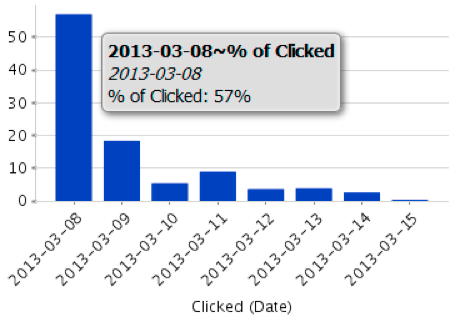

# Het e-mailanalysegebied {#understanding-the-email-analysis-area}

Het gebied van de Analyse E-mail concentreert zich op e-mailmetriek. In dit artikel worden alle rapporten geïntroduceerd die in het artikel beschikbaar zijn.

>[!NOTE]
>
>**Beschikbaarheid**
>
>Dit is beschikbaar voor gebruikers met de Invoegtoepassing Uitgezochte Uitgave of [Inkoopcyclusanalyse](http://www.marketo.com/global-enterprise/marketo-revenue-cycle-analytics/) . Neem contact op met je verkoper voor meer informatie.

## E-mail klikken op Activiteit, warmteraster {#email-click-activity-heat-grid}

In dit rapport ziet u welke dag van de week en het tijdstip van de dag waarop uw leads op e-mails klikken. Hoe groener de doos, des te meer klikt u op die specifieke dag en tijd. Het huidige filter bevat alle e-mails die in de laatste 7 dagen zijn verzonden. De tijd is in CST.

## Op e-mail geklikt tijddistributie {#email-clicked-time-distribution}

Dit rapport toont u het percentage van totale e-mailklikken voor elke tijd van de dag. Het huidige filter bevat alle e-mails die in de laatste 7 dagen zijn verzonden. De tijd is in CST.

## Verval e-mailkliksnelheid {#email-click-rate-decay}

In dit rapport ziet u welk percentage van de totale e-mailklikken heeft plaatsgevonden op dezelfde dag dat een e-mail is verzonden en de daaropvolgende dagen. Het huidige filter bevat alle e-mails die zeven dagen geleden zijn verzonden.

## Heatraster voor e-mail met open activiteit {#email-open-activity-heat-grid}

In dit rapport ziet u welke dag van de week en het tijdstip van de dag waarop uw leads e-mails openen. Hoe groener de doos, des te meer wordt geopend in die specifieke dag en tijd. Het huidige filter bevat alle e-mails die in de laatste 7 dagen zijn verzonden. De tijd is in CST.

## Snelheid verlagen openen {#open-rate-decay}

In dit rapport ziet u welk percentage van het totale aantal e-mailberichten is geopend op dezelfde dag dat een e-mail is verzonden en op de volgende dagen. Het huidige filter bevat alle e-mails die zeven dagen geleden zijn verzonden.

## Tijdverdeling openen {#open-time-distribution}

Dit rapport toont u het percentage van totale e-mail opent voor elke tijd van de dag. Het huidige filter bevat alle e-mails die in de laatste 7 dagen zijn verzonden. De tijd is in CST.

## Verstuurd activiteitsverwarmingsraster {#sent-activity-heat-grid}

In dit rapport ziet u welke dag van de week en het tijdstip van de dag u uw e-mails verzendt. Hoe groener de doos, des te meer verzonden e-mails op die specifieke dag en tijd. Het huidige filter bevat alle e-mails die in de laatste 7 dagen zijn verzonden. De tijd is in CST.

