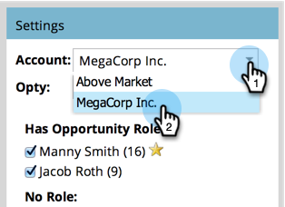
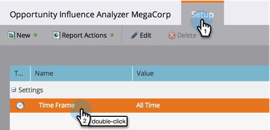
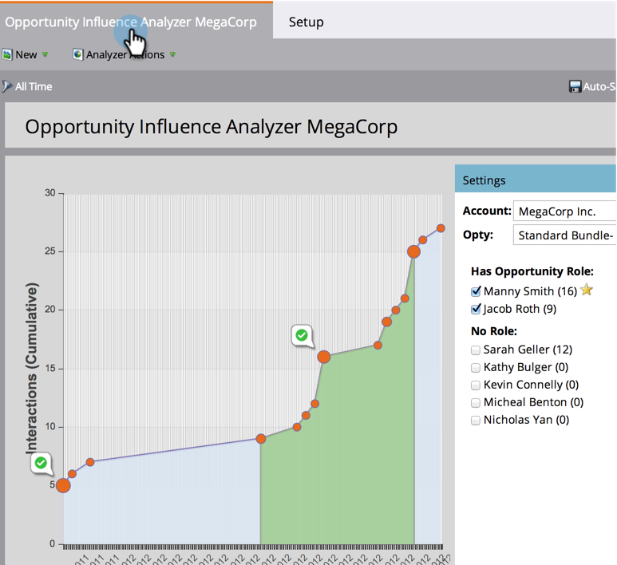

# Een Opportunity Influence Analyzer maken {#create-an-opportunity-influence-analyzer}

Gebruik de Analysator van de Invloed van de Kans om de bijdrage van de marketing aan een belangrijke overeenkomst te tonen. Bekijk uw programma- en gebeurtenissuccessen en interessante momenten in het leven van een kans.

>[!NOTE]
>
>Om goede informatie van een Analysator van de Invloed van de Mogelijkheid te krijgen, zorg ervoor dat uw contacten aan de kansen in uw CRM in bijlage zijn.

1. Klik op **[!UICONTROL Analytics]**.

   

1. Klik op **[!UICONTROL Opportunity Influence Analyzer]**.

   

1. Selecteer de account in het deelvenster **[!UICONTROL Settings]** .

   

   >[!NOTE]
   >
   >Klik op **[!UICONTROL Close]** als u een waarschuwing ontvangt dat er tijdens de tijdsperiode geen activiteiten zijn. We zullen daar na de volgende stap op terugkomen.

1. Selecteer de mogelijkheid in dat account.

   

1. Stel de tijdsperiode in. Klik op de tab **[!UICONTROL Setup]** en dubbelklik **[!UICONTROL Time Frame]** .

   

1. Selecteer de tijdsperiode van de mogelijkheid die u wilt analyseren en klik op **[!UICONTROL Save]** .

   

   >[!TIP]
   >
   >
   >In de meeste gevallen is **[!UICONTROL All Time]** de eenvoudigste keuze.

1. Je bent er! Klik op het hoofdtabblad om de interessante momenten en successen te zien die bij de opportuniteit horen.

   

>[!TIP]
>
>U kunt ook op een video over de Analysator van de Invloed van de Mogelijkheid in [ Universiteit van Marketo ](https://learn.marketo.com) letten. (Het ziet er nu een beetje anders uit, maar er is nog veel te leren!)

>[!MORELIKETHIS]
>
>* [ vertel het Verbod van het Op de markt brengen Artikel met Analysator van de Invloed van de Kans ](/help/marketo/product-docs/reporting/revenue-cycle-analytics/opportunity-influence-analyzer/tell-the-marketing-story-with-an-opportunity-influence-analyzer.md)
>* [ vorm een Analysator van de Invloed van de Opportunity ](/help/marketo/product-docs/reporting/revenue-cycle-analytics/opportunity-influence-analyzer/configure-an-opportunity-influence-analyzer.md)
