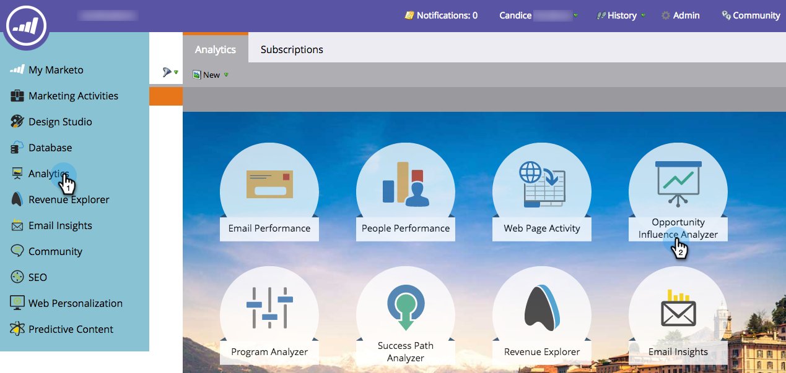

# Vertel het Marketing Story met een Analyse van de Invloed van de Mogelijkheid {#tell-the-marketing-story-with-an-opportunity-influence-analyzer}

Gebruik een Analysator van de Gevolgen van de Kans om de rol van de marketing in belangrijke kansen te illustreren. Toon hoe marketing een kans beïnvloedde, van eerste aanraking tot opportuniteitsschepping en win, en verder.

>[!PREREQUISITES]
>
>[Een Opportunity Influence Analyzer maken](/help/marketo/product-docs/reporting/revenue-cycle-analytics/opportunity-influence-analyzer/create-an-opportunity-influence-analyzer.md)

1. Ga naar **Analyse** en selecteert u de **Opportunity Influence Analyzer**.

   

   De analyse van de Invloed van de Kans is een visuele vertegenwoordiging van de interactie en programma en gebeurtenissuccessen betrokken bij die kans. Laten we de grafiek verkennen:

   *  **Oranje stippen** Dit zijn interessante momenten in de opportuniteit (e-mails geopend, winkelbezoeken, downloads enz.). Grotere stippen geven meer interacties aan.

   *  **Bindingspictogrammen** geeft de resultaten van het programma aan.

   *  **Kalenderpictogrammen** Gebeurtenis aangeven.

   * **Opportuniteitsperiode**. Het groene gebied biedt de mogelijkheid zelf, van het creëren van kansen tot het sluiten van kansen (gewonnen of verloren).

   * **Levenscyclus van kansen**. De grijze gebieden voor en na de groene opportuniteitsperiode laten de interacties zien die tot de kans hebben geleid en deze hebben gevolgd.

   De **Instellingen** worden de personen van het account weergegeven:

   * De **getal tussen haakjes** is het aantal interactie met die contactpersoon.

   * De **gele ster** Hiermee wordt de primaire contactpersoon aangegeven.

1. Houd de muisaanwijzer boven een naam om de functie van die persoon en de bron van zijn betrokkenheid bij de kans te zien.

   

1. Schakel het selectievakje in om de interactie van die persoon op te nemen in de grafiek.

   

   De grafiek wordt automatisch aangepast om de interactie tussen de grafiek en de grafiek weer te geven. In dit voorbeeld zien we onmiddellijk dat MegaCorp CEO Sarah Geller diep betrokken was bij de kans, hoewel ze geen rol toegewezen had in de CRM voor de kans.

1. Klik op een oranje stip om de details van de interactie weer te geven.

   

   In ons voorbeeld leren we dat CEO Sarah Geller de website meerdere keren heeft bezocht en zelfs op de blog heeft geabonneerd. Dit wijst erop dat de interesse van MegaCorp in de kans grotendeels werd gedreven door marketingprogramma&#39;s en activa.

   Klik op meer oranje stippen in de tijdlijn om het verhaal van de gebeurtenissen, programma&#39;s en interessante momenten die hebben bijgedragen tot het creëren en sluiten van de kans te vullen.

   >[!MORELIKETHIS]
   >
   >[Een Opportunity Influence Analyzer configureren](/help/marketo/product-docs/reporting/revenue-cycle-analytics/opportunity-influence-analyzer/configure-an-opportunity-influence-analyzer.md)
