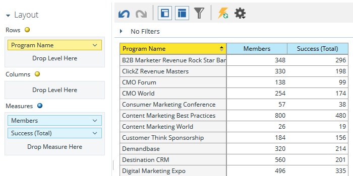

# Bouw een Rapport van de Analyse van de Analyse van het Lidmaatschap van het Programma dat Landen opsomt {#build-a-program-membership-analysis-report-that-lists-leads}

Ga als volgt te werk om een rapport van de Analyse van het Lidmaatschap van het Programma tot stand te brengen dat u alle namen van de programmaleden zal tonen.

>[!AVAILABILITY]
>
>Niet alle Marketo Engage-gebruikers hebben deze functionaliteit aangeschaft. Neem contact op met het Adobe-accountteam (uw accountmanager) voor meer informatie.

1. Start **[!UICONTROL Revenue Explorer]** .

   

1. Klik op **[!UICONTROL Create New]** en vervolgens op **[!UICONTROL Report]** .

   

1. Selecteer **[!UICONTROL Program Membership Analysis]** en klik op **[!UICONTROL OK]** .

   

1. Dubbelklik op de **[!UICONTROL Program Name]** gele stip.

   

1. Dubbelklik op de **[!UICONTROL Members]** blauwe stip.

   

1. Dubbelklik op de **[!UICONTROL Success (Total)]** blauwe stip.

   

Zie hoe gemakkelijk dat was?

U kunt snel een doorloopkenmerk toevoegen, zoals _[!UICONTROL Full Name]_, om te zien wie de leden zijn.

>[!TIP]
>
>Er zijn genoeg lood/bedrijfattributen om van te kiezen. Bekijk ze eens!

1. Dubbelklik op de **[!UICONTROL Full Name]** gele stip.

   

Daar heb je het!

