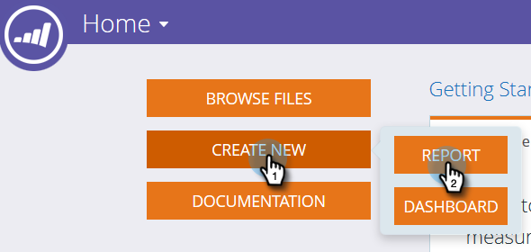

# Bouw een Rapport van de Analyse van de Analyse van het Lidmaatschap van het Programma dat van LIJST {#build-a-program-membership-analysis-report-that-lists-leads} leidt

Ga als volgt te werk om een rapport van de Analyse van het Lidmaatschap van het Programma tot stand te brengen dat u alle namen van de programmaleden zal tonen.

>[!AVAILABILITY]
>
>Niet alle klanten hebben deze functionaliteit aangeschaft. Neem contact op met je verkoper voor meer informatie.

1. Start Revenue Explorer.

   

1. Klik **Nieuw maken** dan **Rapport**.

   

1. Selecteer **Analyse van het Lidmaatschap van het Programma** en klik **OK**.

   

1. Dubbelklik op de gele stip Program Name.

   

1. Dubbelklik op de blauwe stip voor leden.

   

1. Dubbelklik op de blauwe stip Succes (Totaal).

   

Zie hoe gemakkelijk dat was?

U kunt snel een loodattribuut zoals _Volledige Naam_ toevoegen om te zien wie de leden zijn.

>[!TIP]
>
>Er zijn genoeg lood/bedrijfattributen om van te kiezen. Bekijk ze!

1. U kunt de **Volledige naam** gele stip zoeken en erop dubbelklikken.

   

Daar heb je het!

