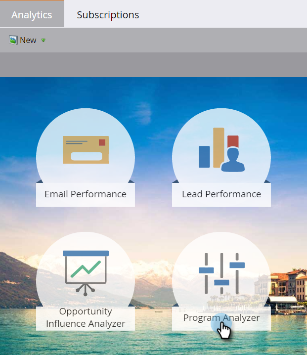

# Een programmaanalyse klonen {#clone-a-program-analyzer}

Nadat u een analysator hebt opgeslagen, is het gemakkelijk om het te klonen om nieuwe te creëren. Ga vervolgens in en bewerk de nieuwe als er wijzigingen nodig zijn.

1. Klik op de tegel **[!UICONTROL Analytics]** .

   

1. Klik op de tegel **[!UICONTROL Program Analyzer]** .

   

1. Open, terwijl de opgeslagen analysator is geopend, het vervolgkeuzemenu Handelingen Analyzer en selecteer **[!UICONTROL Clone Analyzer]** .

   

1. Selecteer de locatie voor de gekloonde analysator in de vervolgkeuzelijst **[!UICONTROL Clone To]** en **[!UICONTROL Folder]** .

   

1. Geef de gekloonde analysator een naam en klik op **[!UICONTROL Clone]** .

   

1. Nu heb je twee identieke analysatoren met verschillende namen. Open de kloon om de gewenste wijzigingen aan te brengen.

   

   >[!MORELIKETHIS]
   >
   >[ Maak een [!UICONTROL Program Analyzer]](/help/marketo/product-docs/reporting/revenue-cycle-analytics/program-analytics/create-a-program-analyzer.md)
