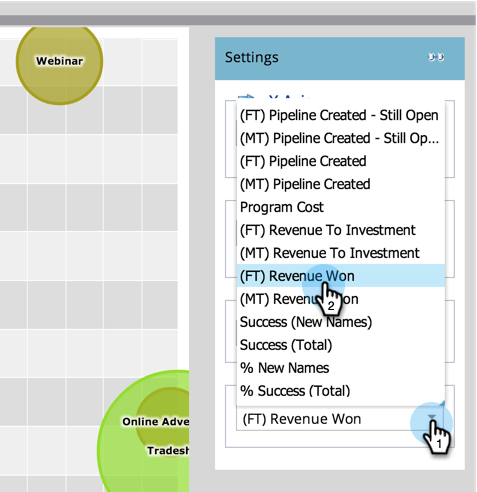

# Kanaaleffectiviteit vergelijken met de [!UICONTROL Program Analyzer] {#compare-channel-effectiveness-with-the-program-analyzer}

Gebruik [!UICONTROL Program Analyzer] om kanaalkosten, lidverwerving, pijpleiding, opbrengst en meer te vergelijken, om uw meest en minst efficiënte kanalen te identificeren.

>[!PREREQUISITES]
>
>[ Maak een [!UICONTROL Program Analyzer]](/help/marketo/product-docs/reporting/revenue-cycle-analytics/program-analytics/create-a-program-analyzer.md)

1. Klik op **[!UICONTROL Analytics]** in **Mijn Marketo**.

   

1. Selecteer de Analysator van het Programma.

   

1. Wijzig de weergave in **[!UICONTROL By Channel]** .

   

1. Gebruik de vervolgkeuzelijst **[!UICONTROL X Axis]** om een metrische waarde voor de horizontale as te kiezen. Laten we beginnen met **[!UICONTROL Program Cost]** .

   

1. Gebruik de vervolgkeuzelijst **[!UICONTROL Y Axis]** om een metrische waarde voor de verticale as te kiezen. Hier gaan we met **[!UICONTROL (FT) Pipeline Created]** .

   

   >[!NOTE]
   >
   >Veel van de metriek die u kunt kiezen in de programmaanalysator, zijn beschikbaar met first-touch (FT) en multi-touch (MT) berekeningen. Het is belangrijk om het [ verschil tussen FT en MT attributie ](/help/marketo/product-docs/reporting/revenue-cycle-analytics/revenue-tools/attribution/understanding-attribution.md) te begrijpen.

1. Kies **[!UICONTROL Y Axis]** in de vervolgkeuzelijst **[!UICONTROL (MT) Pipeline Created]** .

   

   In deze multitouch-attributieweergave zien we dat het Webinar-kanaal meer invloed heeft op het ontstaan van pijpleidingen en minder kosten dan de Tradeshow- en Online Advertising-kanalen.

   Laten we nu nog twee dimensies toevoegen!

1. Gebruik de vervolgkeuzelijst **[!UICONTROL Bubble Size]** om een extra maatregel te selecteren, zoals **[!UICONTROL New Names]** .

   

1. Kijk hoe de grafiek verandert.

   

   We zien dat het Webinar-kanaal krimpt, zoals gemeten door **[!UICONTROL New Names]** . We kunnen concluderen dat het, hoewel het veel leden heeft, minder effectief is in het genereren van nieuwe leads dan het Tradeshow-kanaal.

1. Tot slot gebruik drop-down Kleur om de vierde dimensie toe te voegen. Laten we **[!UICONTROL (FT) Revenue Won]** selecteren.

   

1. Kijk hoe de kleuren in de grafiek veranderen.

   

   Uit de kleuren leren we dat het Tradeshow-kanaal, de groenste bubbel, de grootste gewonnen omzet heeft beïnvloed, gemeten door first-touch attributie.

1. Nu, als wij metrische Kleur in **[!UICONTROL (MT) Revenue Won]** veranderen, zien wij dat het Online kanaal van Advertising, nu het groenste, meer opbrengst _in tijd_ beïnvloedde dan de kanalen van Webinar en Tradeshow.

   

In ons voorbeeld zien we dat het Tradeshow-kanaal zowel het duurste (het verst naar rechts) is als het meest succesvol (het hoogst op de Y-as) bij het meten van pijpleidingen die door eerste aanraking zijn gemaakt. Laten we nu eens kijken naar de pijplijn van elk kanaal die is gemaakt als gemeten door multi-aanraakkenmerk.

>[!TIP]
>
>De voorbeelden in deze stappen meten doeltreffendheid die op gecreeerde pijpleiding wordt gebaseerd. Gebruik de vervolgkeuzelijst [!UICONTROL Y Axis] om andere manieren te selecteren om de doeltreffendheid van kanalen te meten, zoals [!UICONTROL New Names] , [!UICONTROL Members] , [!UICONTROL Cost per Success] , enz.

>[!MORELIKETHIS]
>
>* [ Ontdek Programma &amp; de Details van het Kanaal met [!UICONTROL Program Analyzer]](/help/marketo/product-docs/reporting/revenue-cycle-analytics/program-analytics/explore-program-and-channel-details-with-the-program-analyzer.md)
>* [ Vergelijk de Doeltreffendheid van het Programma met [!UICONTROL Program Analyzer]](/help/marketo/product-docs/reporting/revenue-cycle-analytics/program-analytics/compare-program-effectiveness-with-the-program-analyzer.md)
