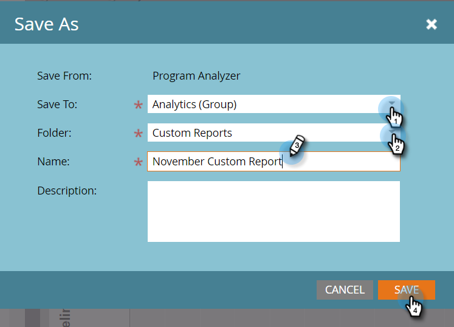

# Een [!UICONTROL Program Analyzer] maken {#create-a-program-analyzer}

Ontdek welke programma&#39;s en kanalen u de grootste waar voor uw marketinggeld geven. Gebruik de programmaanalysator om elke kosten te onderzoeken en te vergelijken en gedetailleerd, door programma of door kanaal terug te keren.

>[!NOTE]
>
>Om goede gegevens van een programmaanalysator te krijgen, zorg ervoor uw contacten van CRM rollen in de kansen hebben, en dat uw programma&#39;s van Marketo volledig opstelling zijn, met [ bepaalde tijdkosten ](/help/marketo/product-docs/reporting/revenue-cycle-analytics/revenue-tools/define-period-costs.md), programmastatussen, en succes.

>[!TIP]
>
>Om programma&#39;s zonder kosten te maken verschijnen in de programmaanalysator, [ plaats hun periode kosten ](/help/marketo/product-docs/reporting/revenue-cycle-analytics/revenue-tools/define-period-costs.md) aan $0.

1. Klik op de tegel **[!UICONTROL Analytics]** .

   

1. Klik op de tegel **[!UICONTROL Program Analyzer]** .

   

1. De standaardprogramma-analysator wordt weergegeven. Breng de gewenste wijzigingen aan.

   

1. Klik op het tabblad **[!UICONTROL Setup]** om filters toe te voegen en aan te passen.

   

1. Als u bijvoorbeeld het filter [!UICONTROL Period Cost] wilt aanpassen, dubbelklikt u erop.

   

1. Selecteer de periode die u wilt analyseren en klik op **[!UICONTROL Apply]** .

   

   >[!TIP]
   >
   >Selecteer **[!UICONTROL Custom]** en gebruik de velden **[!UICONTROL From]** en **[!UICONTROL To]** om een specifiek bereik te selecteren.

1. Selecteer **[!UICONTROL Analyzer Actions]** als u de nieuwe aangepaste analysator wilt opslaan in de vervolgkeuzelijst **[!UICONTROL Save As]** .

   

1. Selecteer met de vervolgkeuzelijsten [!UICONTROL Save To] en [!UICONTROL Folder] de locatie waar u de aangepaste analysator wilt opslaan. Geef de nieuwe aangepaste analysator een naam. Een beschrijving is optioneel. Klik op **[!UICONTROL Save]**.

   

1. Je hebt het gedaan! Klik op het hoofdtabblad om uw programma&#39;s en kanalen te onderzoeken en te vergelijken.

>[!NOTE]
>
>Veel van de metriek die u kunt kiezen in de programmaanalysator, zijn beschikbaar met first-touch (FT) en multi-touch (MT) berekeningen. Het is belangrijk om het [ verschil tussen FT en MT attributie ](/help/marketo/product-docs/reporting/revenue-cycle-analytics/revenue-tools/attribution/understanding-attribution.md) te begrijpen.

>[!MORELIKETHIS]
>
>* [ vergelijk de Doeltreffendheid van het Kanaal met [!UICONTROL Program Analyzer]](/help/marketo/product-docs/reporting/revenue-cycle-analytics/program-analytics/compare-channel-effectiveness-with-the-program-analyzer.md)
>* [ Vergelijk de Doeltreffendheid van het Programma met [!UICONTROL Program Analyzer]](/help/marketo/product-docs/reporting/revenue-cycle-analytics/program-analytics/compare-program-effectiveness-with-the-program-analyzer.md)
>* [ Ontdek Programma &amp; de Details van het Kanaal met [!UICONTROL Program Analyzer]](/help/marketo/product-docs/reporting/revenue-cycle-analytics/program-analytics/explore-program-and-channel-details-with-the-program-analyzer.md)
>* [ Klonen a [!UICONTROL Program Analyzer]](/help/marketo/product-docs/reporting/revenue-cycle-analytics/program-analytics/clone-a-program-analyzer.md)
