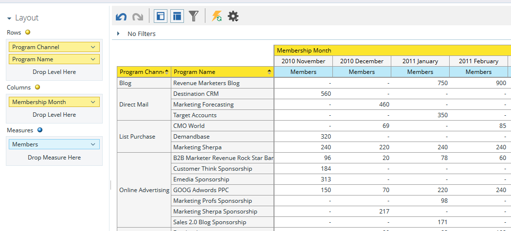
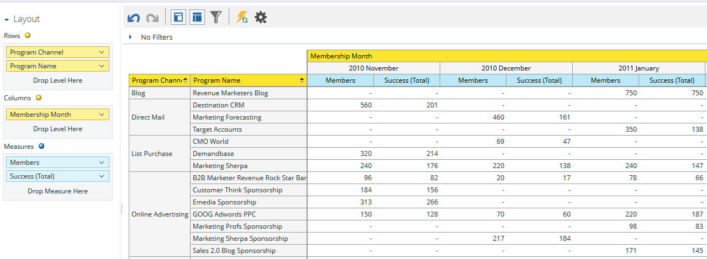

# Inzicht in het analysegebied van het lidmaatschap van het programma {#understanding-the-program-membership-analysis-area}

Op het gebied van de analyse van het lidmaatschap van het programma kunt u de doeltreffendheid van individuele programma&#39;s analyseren of samengevatte resultaten per kanaal voor een bepaalde periode zien.

## Voorbeelden van zakelijke vragen {#example-business-questions}

Hoeveel mensen namen per kanaal deel aan een programma in een bepaalde maand?

Hoeveel mensen hebben de succescriteria voor een bepaald programma bereikt?

Hoeveel nieuwe namen produceerde elk programma/kanaal per maand?

## Dimensies en maatregelen van de analyse van het lidmaatschap van het programma {#program-membership-analysis-dimensions-and-measures}

>[!NOTE]
>
>Gele stippen zijn afmetingen en blauwe stippen zijn maateenheden.

### Lidmaatschap {#membership}

| Meetlat | Beschrijving |
|---|---|
| % nieuwe namen | Percentage van de in een programma verworven leads |
| Leden | Totaal aantal leads in een programma |
| Nieuwe namen | Totaal aantal nieuwe namen verkregen door een programma |

### Programmakenmerken {#program-attributes}

| Dimension | Beschrijving |
|---|---|
| Programmakanaal | Programmakanaal |
| Programmanaam | Programmanaam |

### Tijdschema voor programmamededeling {#program-membership-timeframe}

| Dimension | Beschrijving |
|---|---|
| Jaar | Tijdschema voor lidmaatschap van programma |
| Kwart | Tijdschema voor lidmaatschap van programma |
| Maand | Tijdschema voor lidmaatschap van programma |
| Week | Tijdschema voor lidmaatschap van programma |
| Datum | Tijdschema voor lidmaatschap van programma |

### Succes {#success}

| Meetlat | Beschrijving |
|---|---|
| % geslaagd (nieuwe namen) | Percentage van de door het programma verworven leads EN geslaagd in de voortgang van het programma |
| % geslaagd (totaal) | Percentage voorsprong die succes heeft geboekt bij de voortgang van een programma |
| Succes (nieuwe namen) | Totaal aantal nieuwe namen dat succes heeft geboekt bij de voortgang van een programma |
| Geslaagd (totaal) | Totaal aantal leads dat succes heeft geboekt bij de voortgang van een programma |
