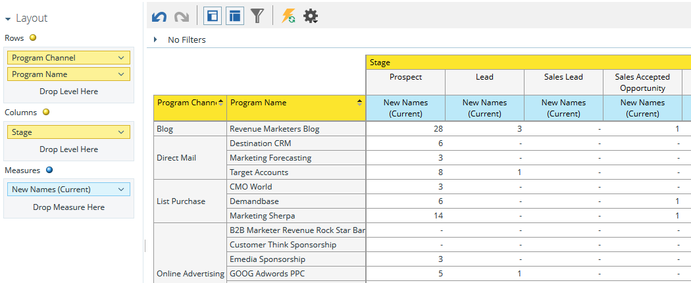

# Het onderzoeksgebied {#understanding-the-program-revenue-stage-analysis-area} van het Stadium van de Opbrengst van het Programma begrijpen

Op dit analysegebied kunt u de doeltreffendheid van afzonderlijke programma&#39;s analyseren of de samengevatte resultaten per kanaal bekijken. Het verstrekt inzicht in hoeveel van de nieuwe geproduceerde namen bijzondere succeswegstadia binnen uw model van de opbrengstcyclus hebben bereikt.

**Voorbeeld van zakelijke vragen die u kunt beantwoorden met behulp van dit analysegebied zijn**:

Hoeveel nieuwe namen van een bepaald programma hebben ooit een specifieke fase in mijn model bereikt?

Hoeveel nieuwe namen van een bepaald programma bevinden zich momenteel in een specifiek stadium in mijn model?

Hoeveel dagen neemt de Commissie om het huidige stadium te bereiken?

**Dimension en maatregelen voor de analyse van de inkomstenfase van het programma**

Dimension en metingen worden ingedeeld in categorieën en worden weergegeven door gele of blauwe stippen in het systeem: geel voor de afmetingen en blauw voor de afmetingen. Gebruik de analysen van de fase van de programmaopbrengst en maatregelen om specifieke vragen in uw rapport te beantwoorden.

Als u de beschikbare afmetingen of maateenheden in een categorie wilt weergeven, klikt u op de pijl naar rechts naast de naam van een categorie om de categorielijst uit te vouwen. Klik op de pijl omlaag om de categorielijst samen te vouwen.

>[!TIP]
>
>Als u meer informatie wilt over een bepaalde dimensie of maatregel terwijl u in het rapport staat, plaatst u de muisaanwijzer boven de dimensie of maatregel.

**Modelkenmerken**

<table> 
 <tbody> 
  <tr> 
   <td colspan="1" rowspan="1"><strong>Dimension</strong></td> 
   <td colspan="1" rowspan="1">
<strong>Beschrijving</strong>
</td> 
  </tr> 
  <tr> 
   <td colspan="1" rowspan="1">
Is model actief
</td> 
   <td colspan="1" rowspan="1">
Beschrijft als het model momenteel wordt goedgekeurd en actief is
</td> 
  </tr> 
  <tr> 
   <td colspan="1" rowspan="1">
Is werkgebied actief
</td> 
   <td colspan="1" rowspan="1">
Hiermee wordt beschreven of het werkgebied actief is
</td> 
  </tr> 
  <tr> 
   <td colspan="1" rowspan="1">
Op pad naar succes
</td> 
   <td colspan="1" rowspan="1">
Beschrijft of het stadium op de succesweg al dan niet is
</td> 
  </tr> 
  <tr> 
   <td colspan="1" rowspan="1">
Model
</td> 
   <td colspan="1" rowspan="1">
Modelnaam
</td> 
  </tr> 
  <tr> 
   <td colspan="1" rowspan="1">
Werkgebied
</td> 
   <td colspan="1" rowspan="1">
De stadia die in uw model van de opbrengstcyclus bestaan. Wordt gebruikt als de Van-fase bij het analyseren van metingen tussen twee fasen
</td> 
  </tr> 
  <tr> 
   <td colspan="1" rowspan="1">
Type werkgebied
</td> 
   <td colspan="1" rowspan="1">
Beschrijft welk type; Inventaris, SLA of Gate elk stadium is
</td> 
  </tr> 
 </tbody> 
</table>

**Programmakenmerken**

<table> 
 <tbody> 
  <tr> 
   <td colspan="1" rowspan="1">
<strong>Dimension</strong>
</td> 
   <td colspan="1" rowspan="1">
<strong>Beschrijving</strong>
</td> 
  </tr> 
  <tr> 
   <td colspan="1" rowspan="1">
Programmakanaal
</td> 
   <td colspan="1" rowspan="1">
Programmakanaal
</td> 
  </tr> 
  <tr> 
   <td colspan="1" rowspan="1">
Programmanaam
</td> 
   <td colspan="1" rowspan="1">
Programmanaam
</td> 
  </tr> 
 </tbody> 
</table>

**Tijdslimiet voor programmakosten**

<table> 
 <tbody> 
  <tr> 
   <td colspan="1" rowspan="1">
<strong>Dimension</strong>
</td> 
   <td colspan="1" rowspan="1">
<strong>Beschrijving</strong>
</td> 
  </tr> 
  <tr> 
   <td colspan="1" rowspan="1">
Kostenjaar
</td> 
   <td colspan="1" rowspan="1">
Tijdschema voor programmakosten
</td> 
  </tr> 
  <tr> 
   <td colspan="1" rowspan="1">
Kostenkwartaal
</td> 
   <td colspan="1" rowspan="1">
Tijdschema voor programmakosten
</td> 
  </tr> 
  <tr> 
   <td colspan="1" rowspan="1">
Kostenmaand
</td> 
   <td colspan="1" rowspan="1">
Tijdschema voor programmakosten
</td> 
  </tr> 
 </tbody> 
</table>

**Lidmaatschap werkgebied**

<table> 
 <tbody> 
  <tr> 
   <td colspan="1" rowspan="1">
<strong>Meetlat</strong>
</td> 
   <td colspan="1" rowspan="1">
<strong>Beschrijving</strong>
</td> 
  </tr> 
  <tr> 
   <td colspan="1" rowspan="1">
Is model actief
</td> 
   <td colspan="1" rowspan="1">
Beschrijft als het model momenteel wordt goedgekeurd en actief is
</td> 
  </tr> 
  <tr> 
   <td colspan="1" rowspan="1">
Is werkgebied actief
</td> 
   <td colspan="1" rowspan="1">
Hiermee wordt beschreven of het werkgebied actief is
</td> 
  </tr> 
  <tr> 
   <td colspan="1" rowspan="1">
Op pad naar succes
</td> 
   <td colspan="1" rowspan="1">
Beschrijft of het stadium op de succesweg al dan niet is
</td> 
  </tr> 
  <tr> 
   <td colspan="1" rowspan="1">
Kosten per nieuwe naam
</td> 
   <td colspan="1" rowspan="1">
De gemiddelde kosten van een nieuwe naam die ooit het werkgebied heeft bereikt
</td> 
  </tr> 
  <tr> 
   <td colspan="1" rowspan="1">
Nieuwe namen (huidig)
</td> 
   <td colspan="1" rowspan="1">
Het totale aantal leads dat zich momenteel in de fase bevinden en door het programma zijn aangeschaft
</td> 
  </tr> 
  <tr> 
   <td colspan="1" rowspan="1">
Nieuwe namen (ooit)
</td> 
   <td colspan="1" rowspan="1">
Beschrijft welk type; Inventaris, SLA of Gate elk stadium is
</td> 
  </tr> 
 </tbody> 
</table>

>[!MORELIKETHIS]
>
>[Een rapport van de inkomstenverkenner maken](/help/marketo/product-docs/reporting/revenue-cycle-analytics/revenue-explorer/create-a-revenue-explorer-report.md)
