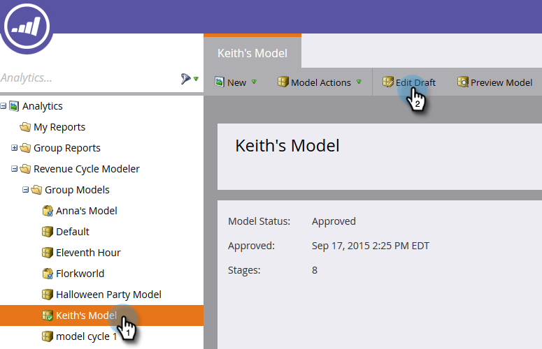

# Uw goedgekeurde model bewerken {#editing-your-approved-model}

## Uw model bewerken {#editing-your-model}

1. Selecteer het model waarop u wijzigingen wilt aanbrengen in de sectie [!UICONTROL Analytics] en klik op **[!UICONTROL Edit Draft]** .

   

1. U kunt geen fasen verwijderen tijdens het bewerken van een conceptmodel (nadat het model is goedgekeurd). In plaats daarvan kunt u dat werkgebied samenvoegen met een ander werkgebied in het model. Klik met de rechtermuisknop op het werkgebied dat u wilt samenvoegen en klik op **[!UICONTROL Merge]** .

   

1. Kies het nieuwe werkgebied voor leads die momenteel in de geselecteerde worden weergegeven of selecteer **[!UICONTROL None]** om de leads uit uw model te verwijderen. Klik op **[!UICONTROL Merge]** als u klaar bent.

   

1. Als u klaar bent met het aanbrengen van wijzigingen in het model, kunt u het opnieuw goedkeuren door **[!UICONTROL Approve Model Draft]** in het menu **[!UICONTROL Model Actions]** te selecteren.

   

   >[!TIP]
   >
   >Als u wijzigingen aanbrengt in uw fasen, zoals het toevoegen of samenvoegen van de fasen, wijzigt u de waarden in [!UICONTROL Assignment Rules] en Phases in de richting van uw bewerkingen.

## Uw model niet goedkeuren {#unapproving-your-model}

>[!CAUTION]
>
>Als u uw model niet goedkeurt, worden alle leads verwijderd en wordt de geschiedenis in het model verwijderd. U kunt uw model ook bewerken in plaats van het niet goed te keuren.

1. Selecteer het model dat u niet wilt goedkeuren. Selecteer **[!UICONTROL Model Actions]** in het menu **[!UICONTROL Unapprove Model]** .

   

1. Klik op **[!UICONTROL Unapprove]**.

   

>[!NOTE]
>
>Als u dit model opnieuw wilt goedkeuren, zult u eerst verbindingen aan de stadia opnieuw moeten toewijzen.

## Meer modellen maken {#creating-more-models}

U kunt slechts één goedgekeurd model tegelijk hebben. Als u een model wilt goedkeuren maar reeds één goedgekeurd, zult u uw huidig model eerst moeten goedkeuren. Bewerk indien mogelijk uw model in plaats van een nieuw model te maken.

>[!MORELIKETHIS]
>
>[ creeer een Nieuw Model van de Opbrengst ](/help/marketo/product-docs/reporting/revenue-cycle-analytics/revenue-cycle-models/create-a-new-revenue-model.md)
