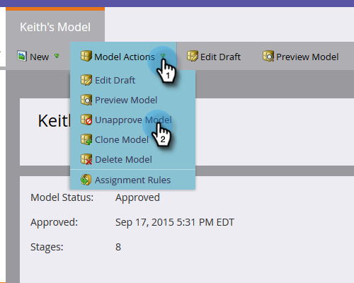

# Uw goedgekeurde model bewerken {#editing-your-approved-model}

## Uw model bewerken {#editing-your-model}

1. Selecteer in de sectie Analytics het model dat u wilt wijzigen en klik op Concept **** bewerken.

   

1. U kunt geen fasen verwijderen tijdens het bewerken van een conceptmodel (nadat het model is goedgekeurd). In plaats daarvan kunt u dat werkgebied samenvoegen met een ander werkgebied in het model. Klik met de rechtermuisknop op het werkgebied dat u wilt samenvoegen en klik op **Samenvoegen**.

   

1. Kies het nieuwe werkgebied voor leads die momenteel in de geselecteerde worden weergegeven of selecteer **Geen **om de leads uit uw model te verwijderen. Klik op **Samenvoegen** als u klaar bent.

   

1. Als u klaar bent met het aanbrengen van wijzigingen in het model, kunt u het opnieuw goedkeuren door Modelconcept **** goedkeuren te selecteren in het menu **Modelacties** .

   

   >[!TIP]
   >
   >Als u om het even welke veranderingen in uw stadia aanbrengt, zoals het toevoegen van of het samenvoegen van hen, zorg ervoor om uw Regels en Fases van de Toewijzing te veranderen om op uw uitgeeft te wijzen.

## Uw model niet goedkeuren {#unapproving-your-model}

>[!CAUTION]
>
>Als u uw model niet goedkeurt, worden alle leads verwijderd en wordt de geschiedenis in het model verwijderd. U kunt uw model ook bewerken in plaats van het niet goed te keuren.

1. Selecteer het model dat u niet wilt goedkeuren. Selecteer Model **** goedkeuren in het menu **Modelacties**.

   

1. Klik op **Niet goedkeuren**.

   

>[!NOTE]
>
>Als u dit model opnieuw wilt goedkeuren, zult u eerst verbindingen aan de stadia opnieuw moeten toewijzen.

## Meer modellen maken {#creating-more-models}

U kunt slechts één goedgekeurd model tegelijk hebben. Als u een model wilt goedkeuren maar reeds één goedgekeurd, zult u uw huidig model eerst moeten goedkeuren. Bewerk indien mogelijk uw model in plaats van een nieuw model te maken.

>[!NOTE]
>
>**Verwante artikelen**
>
>[Een nieuw inkomstenmodel maken](../../../../../product-docs/reporting/revenue-cycle-analytics/revenue-cycle-models/create-a-new-revenue-model.md)

