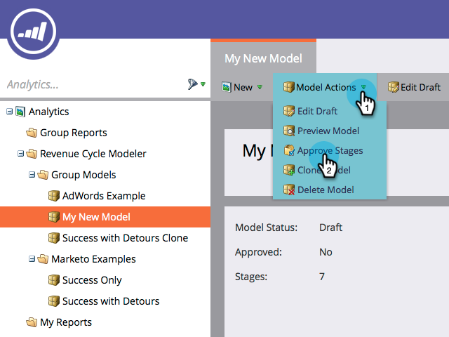
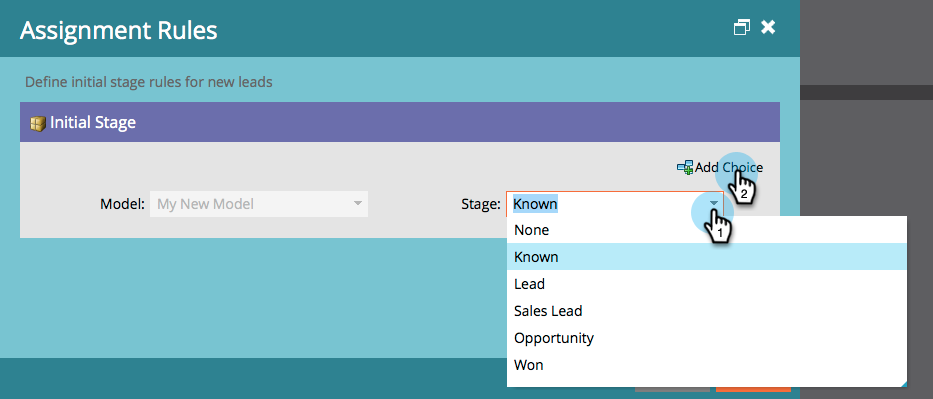

# Het goedkeuren van Stages en het toewijzen van Leidingen aan een model van de Inkomsten {#approving-stages-and-assigning-leads-to-a-revenue-model}

Krijg uw **Model van de Opbrengst** omhoog en lopend door bestaande lood toe te voegen, die toewijzingsregels voor om het even welke nieuwe lood creëren.

## Fases goedkeuren {#approving-stages}

Wij keuren de stadia van uw model goed alvorens u om het even welke lood toevoegt.

1. Ga naar het **[!UICONTROL Analytics]** -gebied.

   

1. Selecteer het model waarvan de stadia u wilt goedkeuren.

   

1. Selecteer onder **[!UICONTROL Model Actions]** de optie **[!UICONTROL Approve Stages]** .

   

1. U wordt begroet met een waarschuwing. Klik op **[!UICONTROL Assign Leads]** .

   

Uitstekend! Laten we verder gaan en die leads toewijzen.

## Bestaande leads toewijzen {#assigning-existing-leads}

[&#x200B; creeer een Slimme Lijst &#x200B;](/help/marketo/product-docs/core-marketo-concepts/smart-lists-and-static-lists/creating-a-smart-list/create-a-smart-list.md) om de lood voor één stadium van uw model in uw Gegevensbestand van de Lood te identificeren.

1. Zodra u [&#x200B; uw Slimme Lijst &#x200B;](/help/marketo/product-docs/core-marketo-concepts/smart-lists-and-static-lists/creating-a-smart-list/create-a-smart-list.md) hebt gecreeerd, klik het **[!UICONTROL Leads]** lusje.

   

1. Klik op **[!UICONTROL Select All]** om de leads te selecteren.

   

1. Open de vervolgkeuzelijst **[!UICONTROL Lead Actions]** en selecteer **[!UICONTROL Special]** . Klik op **[!UICONTROL Change Revenue Stage...]**.

   

1. Selecteer de juiste **[!UICONTROL Model]** en de juiste **[!UICONTROL Stage]** . Klik op **[!UICONTROL Run Now]**.

   

1. Herhaal deze bewerking totdat alle leads zijn toegewezen aan de verschillende stadia van uw model.

Geweldig! Om te specificeren hoe de nieuwe lood aan stadia worden toegewezen, creeer toewijzingsregels.

>[!NOTE]
>
>Als uw model in de Goedgekeurde staat van Stages is, zult u geen gebeurtenissen van het Stadium van de Opbrengst van de Verandering in de de activiteitenlogboeken van de lood zien. Als uw model volledig is goedgekeurd, wordt deze stap overgeslagen als u een lood in het zelfde stadium beweegt het momenteel in is.

## Nieuwe leads: toewijzingsregels maken  {#new-leads-create-assignment-rules}

1. Klik **Begin van Marketo** opnieuw, dan selecteren **[!UICONTROL Analytics]**.

   

1. Klik op het model in de structuur, selecteer vervolgens het menu **[!UICONTROL Model Actions]** en selecteer **[!UICONTROL Assignment Rules]** .

   

1. Als uw toewijzingsregels meer dan één standaardkeuzeklik **[!UICONTROL Stage]** bevatten, maakt u uw selectie en klikt u op **[!UICONTROL Add Choice]** .

   

## Voorbeeld van toewijzingsregel {#example-assignment-rule}

Maak een [!UICONTROL Lead Score] -regel om de nieuwe leads met een minimumscore toe te wijzen aan een geschikte stap.

1. Selecteer onder **[!UICONTROL If]** de optie **[!UICONTROL Lead Score]**. Kies vervolgens **[!UICONTROL at least]** .

   

1. Ga **40** op het gebied in en selecteer **[!UICONTROL Sales Lead]** als [!UICONTROL Stage]. Klik op **[!UICONTROL Save]** om te voltooien.

   

>[!MORELIKETHIS]
>
>Om uw model goed te keuren, lees onze hulppagina op **[goedkeurend en het Ongoedkeuren van een Model van de Ontvangsten](/help/marketo/product-docs/reporting/revenue-cycle-analytics/revenue-cycle-models/approve-unapprove-a-revenue-model.md)**.
