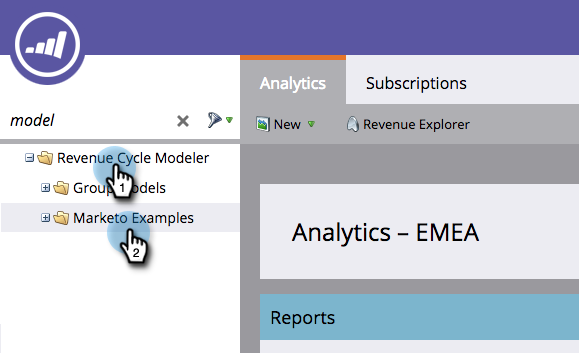

# Een Marketo-model met voorbeeldopbrengsten klonen {#cloning-a-marketo-example-revenue-model}

Marketo heeft voorbeelden van inkomstenmodellen om u te inspireren. Kloon deze modellen en maak ze zelf. Hieronder wordt beschreven hoe:

1. Ga naar de **Analyse** gebied.

   

1. Selecteren **Revenue Cycle Modeler** en klik op **Marketo-voorbeelden**.

   

1. Kies een van de modellen.

   

1. Selecteer bij Modelhandelingen de optie **Kloonmodel**.

   

1. Voer een **Naam** en klik op **Klonen**.

   

   Als het alleen zo eenvoudig was om inkomsten te genereren!
