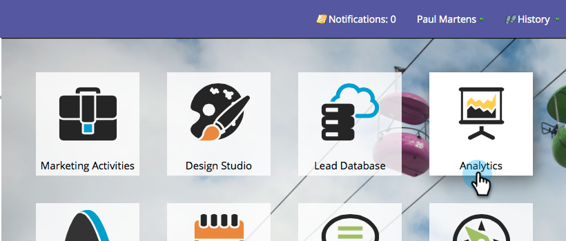
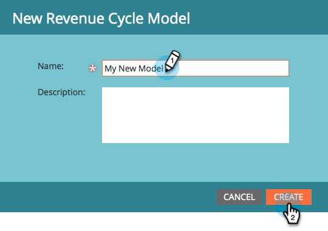

# Een nieuw inkomstenmodel maken {#create-a-new-revenue-model}

1. Klik op de knop **[!UICONTROL Analytics]** in het [!UICONTROL My Marketo] -beginscherm om een nieuw inkomstencyclusmodel te maken.

   

1. Klik op het tabblad **[!UICONTROL Analytics]** op **[!UICONTROL New]** en selecteer **[!UICONTROL New Revenue Cycle Model]** .

   

1. Er wordt een modaal venster van **[!UICONTROL New Revenue Cycle Model]** weergegeven. Voer een naam in en klik op **[!UICONTROL Create]** .

   

1. Klik op **[!UICONTROL Edit Draft]** in de weergave Home van uw model.

   

1. In het nieuwe venster wordt u een model gepresenteerd met zes inventarisfasen, vijf overgangen tussen deze fasen en de mogelijkheid om inventarisatie, SLA en gatfasen toe te voegen.

   

Kijk scherp! Je bent net de prachtige wereld van modellering binnengekomen.

>[!MORELIKETHIS]
>
>Leer meer over [ Gebruikend de Staven van de Inventaris van het Model van de Opbrengst ](/help/marketo/product-docs/reporting/revenue-cycle-analytics/revenue-cycle-models/using-revenue-model-inventory-stages.md).
