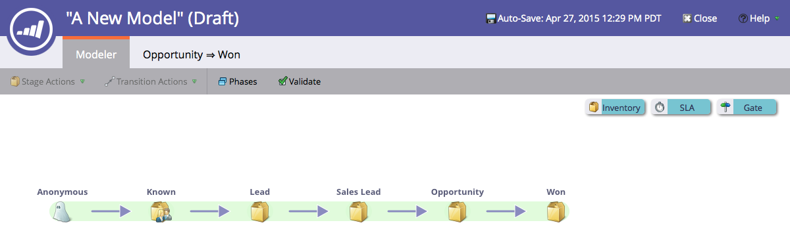

# Nieuw inkomstenmodel maken {#create-a-new-revenue-model}

1. Om een nieuw Model van de Cyclus van de Opbrengst tot stand te brengen klik **Analytics** knoop in het Mijn homescherm van de Marketo.

   

1. Klik op het tabblad **Analytics** op **New** en selecteer **New Revenue Cycle Model**.

   

1. Er verschijnt een modaal venster **New Revenue Cycle Model**. Voer een naam in en klik op **Maken**.

   

1. Klik **Concept** in de huismening van uw model uitgeven.

   

1. In het nieuwe venster, zult u een model met zes inventarisstadia, vijf overgangen tussen deze stadia en de capaciteit worden voorgesteld om inventaris, SLA en gatefasen toe te voegen.

   

Kijk scherp! Je bent net de prachtige wereld van modellering binnengekomen.

>[!MORELIKETHIS]
>
>Meer informatie over [Opbrengstmodelinventarisfasen gebruiken](/help/marketo/product-docs/reporting/revenue-cycle-analytics/revenue-cycle-models/using-revenue-model-inventory-stages.md).
