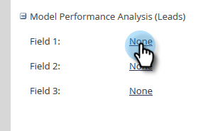

# Aangepaste veldgroepen inschakelen voor analyse van modelprestaties (lead) {#enable-custom-field-groups-for-model-performance-analysis-leads}

>[!PREREQUISITES]
>
>Categoriseer standaard- of aangepaste velden in groepen voor rapportage via de veldOrganizer in Marketo. Voor details, zie [ de Groepen van het Gebied van de Douane via de Organisator van het Gebied ](/help/marketo/product-docs/reporting/revenue-cycle-analytics/revenue-tools/field-organizers/create-custom-field-groups-using-the-field-organizer.md) creëren.

<table> 
 <tbody> 
  <tr> 
   <td colspan="3" rowspan="1">
<strong>Hoe beïnvloedt het toelaten van een Groep van het Gebied van de Douane Veelvoudige Analyse Gebieden in de Ontdekkingsreiziger van de Cyclus van de Ontvangsten?</strong>
</td> 
  </tr> 
  <tr> 
   <td colspan="1" rowspan="1">
<strong>Wat gebeurt er wanneer?</strong>
</td> 
   <td colspan="1" rowspan="1">
<strong>Hoe het het beïnvloedt de  ModelAnalyse van Prestaties (leidt tot)  Gebied</strong>
</td> 
   <td colspan="1" rowspan="1">
<strong>Hoe het de Analyse van de Lood, de Analyse van de Campagne, en de Gebieden van de Analyse van de Kans beïnvloedt</strong>
</td> 
  </tr> 
  <tr> 
   <td colspan="1" rowspan="1">
<strong>Wat gebeurt wanneer u een groep van het douaneveld toelaat verbonden aan een standaardlood of bedrijfgebied?</strong>
</td> 
   <td colspan="1" rowspan="1">
De groep van het douanegebied wordt toegelaten voor het melden in het  ModelAnalyse van Prestaties (Lood)  Gebied
</td> 
   <td colspan="1" rowspan="1">
Geen effect
</td> 
  </tr> 
  <tr> 
   <td colspan="1" rowspan="1">
<strong>Wat gebeurt wanneer u een groep van het douanegebied toelaat verbonden aan een douanepersoon of bedrijfgebied?</strong>
</td> 
   <td colspan="1" rowspan="1">
De groep van het douanegebied wordt toegelaten voor het melden in het  ModelAnalyse van Prestaties (Lood)  Gebied
</td> 
   <td colspan="1" rowspan="1">
Het douanegebied zelf wordt toegelaten voor rapportering in de Gebieden van de Analyse van de Lood, van de Analyse van de Campagne, en van de Analyse van de Kans.

<strong> NOTA:</strong> de gebiedsgroepen van de Douane worden NIET gesteund op deze analysegebieden, zodat tonen de groepsverenigingen niet in de Ontdekkingsreiziger van de Cyclus van de Opbrengst— <em> slechts </em> het douanegebied.
</td> 
  </tr> 
 </tbody> 
</table>

Voer de volgende stappen uit om een aangepaste veldgroep voor rapportage in het [!UICONTROL Model Performance Analysis (Leads)] -gebied in te schakelen.

1. Klik op **[!UICONTROL Admin]**.

   

1. Klik op **[!UICONTROL Revenue Cycle Analytics]**.

   

1. Klik op **[!UICONTROL None]** naast een lege veldgroep. Als u al drie veldgroepen hebt ingeschakeld en u wilt bewerken, klikt u op de naam van de veldgroep die u wilt wijzigen.

   

1. Klik op de vervolgkeuzelijst **[!UICONTROL Field]** en selecteer de gewenste.

   

   >[!NOTE]
   >
   >In dit voorbeeld is een aangepaste veldgroep ingeschakeld voor een standaardveld (Frame). Daarom werd alleen het [!UICONTROL Model Performance Analysis (Leads)] -gebied beïnvloed. Als een aangepaste veldgroep voor een aangepaste persoon of een aangepast bedrijfsveld was ingeschakeld, zou de ingeschakelde groep worden weergegeven in de [!UICONTROL Model Performance Analysis (Leads)] -sectie van het tabblad Overzicht van synchronisatie en zou het aantal aangepaste velden voor de analyse van leads, campagnes en opportuniteit met één toenemen.

1. Klik op **[!UICONTROL Save]**.

   
