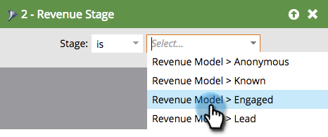

# Alle leads zoeken in een inkomstencyclusmodel {#find-all-leads-in-a-revenue-cycle-model}

Door slimme lijsten te gebruiken, kunt u alle leden van het model van de opbrengstcyclus gemakkelijk vinden.

>[!PREREQUISITES]
>
>[Een slimme lijst maken](/help/marketo/product-docs/core-marketo-concepts/smart-lists-and-static-lists/creating-a-smart-list/create-a-smart-list.md)

1. Selecteer de slimme lijst en klik op het tabblad **Slimme lijst**.

   

1. Zoek het filter **Lid van inkomstenmodel** en sleep het naar het canvas.

   

1. Selecteer een **Model**.

   

   Dit zou je alle leads in dat model geven, ongeacht het werkgebied. Meestal wilt u een specifiek werkgebied. Gebruik in plaats hiervan het volgende filter.

1. Zoek het filter **Opbrengstwerkgebied** en sleep het naar het canvas.

   

1. Selecteer een **werkgebied**.

   

1. Ga naar het tabblad **Leads** om de resultaten weer te geven.

   

   >[!TIP]
   >
   >U hebt beide filters niet nodig, maar kies de gewenste filters. We laten u alleen maar zien dat u allebei grondig te werk gaat. 

   >[!CAUTION]
   >
   >Als het stadium van een lood door een externe campagne tijdens de aanvankelijke verwezenlijking van lood wordt veranderd, dan wordt een activiteit niet het programma geopend in het gegevensbestand. Dit betekent dat de lead niet wordt opgenomen in het filter voor de slimme lijst.
