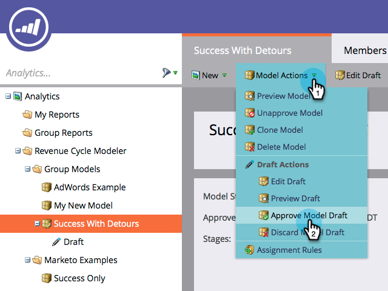

# Twee fasen samenvoegen in de Revenue Modeler {#merging-two-stages-in-the-revenue-modeler}

Nadat u het model hebt goedgekeurd, kunt u geen stadia schrappen wanneer het uitgeven van een ontwerp. In plaats daarvan kunt u dat werkgebied samenvoegen met een ander.

1. Klik **Huis van Marketo** en selecteer **[!UICONTROL Analytics]**.

   

1. Klik op het goedgekeurde model.

   

1. Klikken **[!UICONTROL Edit Draft.]**

   

1. Klik met de rechtermuisknop op het werkgebied dat u wilt samenvoegen en selecteer **[!UICONTROL Merge]Werkgebied** in het menu.

   

1. Klik op het specifieke werkgebied in de vervolgkeuzelijst.

   

1. U kunt het model opnieuw goedkeuren door **[!UICONTROL Approve Model Draft]** in het **[!UICONTROL Model Actions]** menu te selecteren.

   

>[!NOTE]
>
>Kies **[!UICONTROL None]** in de lus [!UICONTROL Merge Stage] pull down om de leads uit uw model te verwijderen
