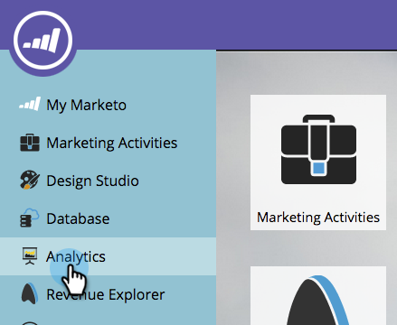

# Rapport over uw inkomstenmodel {#report-on-your-revenue-model}

Voor elk model van de opbrengstcyclus, kunt u een rapport produceren over hoeveel lood in elke fase zijn.

>[!NOTE]
>
>Leads moeten deel uitmaken van het model dat in het rapport moet worden opgenomen.

1. Ga naar **[!UICONTROL Analytics]** .

   

1. Klik op **[!UICONTROL Leads by Revenue Stage]** .

   

1. Klik op de tab **[!UICONTROL Setup]** en dubbelklik vervolgens onder de filtersectie **[!UICONTROL Revenue Cycle Model]** .

   

1. Selecteer de goedgekeurde **[!UICONTROL Model]** .

   

   >[!NOTE]
   >
   >Om beschikbaar te zijn uit dit drop-down menu, moet het model worden goedgekeurd, of minstens goedgekeurde stadia hebben.

1. Klik op het tabblad **[!UICONTROL Report]** om te zien hoeveel leads zich in elke fase van uw model voor de inkomstencyclus bevinden.

   

Waarom is dit nuttig? Het model toont je verkoop en marketing funnel. Houd hun saldi in de loop der tijd bij om knelpunten te identificeren voordat ze een probleem worden.
