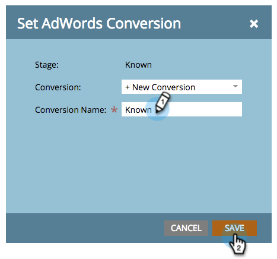

# Conversies [!DNL Google AdWords] instellen in het inkomstenmodel {#set-google-adwords-conversions-in-the-revenue-model}

Koppel uw [!DNL Google AdWords] -account aan Marketo om automatisch offline conversiegegevens te uploaden van Marketo naar [!DNL Google AdWords] . Dan, van [!DNL AdWords] UI, zult u gemakkelijk kunnen zien welke kliks in gekwalificeerde lood, kansen en nieuwe klanten (of welke opbrengststadia resulteerden u) wilt volgen nadat u [&#x200B; douanekolommen &#x200B;](https://support.google.com/adwords/answer/3073556) in [!DNL AdWords] toevoegt.

>[!NOTE]
>
>Dit is een push-integratie van Marketo naar [!DNL Google AdWords] . De gegevens van de omzetting zullen _slechts_ in uw [!DNL Google AdWords] portaal verschijnen, _niet in Marketo UI_.

Leer meer over [&#x200B; de off-line omzettingsde invoereigenschap van Google &#x200B;](https://support.google.com/adwords/answer/2998031?hl=en). Wijs [!DNL AdWords] offline conversies toe aan een of meer fasen in een omzettingsmodel. U kunt de toewijzing op drie manieren uitvoeren:

* [!DNL AdWords] Conversie
* Werkgebied, actie
* [!DNL AdWords] Toewijzing

U kunt vanuit Marketo een nieuwe [!DNL AdWords] offline conversie maken met behulp van Stage Action.

>[!PREREQUISITES]
>
>[&#x200B; voeg  [!DNL Google AdWords]  als Dienst LaunchPoint toe &#x200B;](/help/marketo/product-docs/administration/additional-integrations/add-google-adwords-as-a-launchpoint-service.md)

## [!DNL AdWords] Conversie gebruiken {#use-adwords-conversion}

1. Ga naar het **[!UICONTROL Analytics]** -gebied.

   

1. Selecteer een model.

   

1. Klik op **[!UICONTROL Edit Draft]**.

   

1. Selecteer de inkomstenfase die u wilt toewijzen aan een [!DNL AdWords] -conversie.

   

1. Selecteer de **[!UICONTROL AdWords Conversion]** die u wilt toewijzen aan het Marketo-werkgebied.

   

   Mooi! De conversiegegevens van [!DNL AdWords] worden geüpload naar de [!DNL Google AdWords] -locatie in de geselecteerde map.

## Werkgebiedactie gebruiken {#use-stage-action}

U kunt ook een [!UICONTROL AdWords Conversion] onder **[!UICONTROL Stage Actions]** toewijzen.

1. Selecteer de stap die u wilt toewijzen aan een [!DNL AdWords] -conversie.

   

1. Selecteer **[!UICONTROL Stage Actions]** onder de vervolgkeuzelijst **[!UICONTROL Set AdWords Conversion]** .

   

1. Selecteer een **[!UICONTROL AdWords Conversion]** .

   

   **Uiteinde**: Als u geen [!DNL AdWords] omzettingen hebt, creeer één door **[!UICONTROL +New Conversion]** te klikken.

   

1. Klik op **[!UICONTROL Save]**.

   

1. Nadat u alle omzettingen van [!DNL AdWords] in inkomstenstadia in kaart hebt gebracht, ga terug naar de summiere pagina. Selecteer **[!UICONTROL Model Actions]** en kies **[!UICONTROL Approve Stages]** .

   

## Pro-tip: voeg een nieuwe omzetting toe {#pro-tip-add-a-new-conversion}

Pro tip! Er kan een nieuwe [!DNL AdWords] offline conversie worden gemaakt vanuit Marketo.

>[!CAUTION]
>
>Voor nieuwe omzettingen die zijn gemaakt met Marketo is de instelling &quot;optimalisatie&quot; ingeschakeld. Dit betekent dat biedstrategieën van [!DNL AdWords] zijn toegestaan om uw biedingen voor deze conversies te optimaliseren. U kunt deze instelling wijzigen vanuit uw [!DNL AdWords] -account.

1. Selecteer **[!UICONTROL Stage Actions]** onder de vervolgkeuzelijst **[!UICONTROL Set AdWords Conversion]** .

   

1. Selecteer **[!UICONTROL New Conversion]**.

   

1. Voer een **[!UICONTROL Conversion Name]** in. Klik op **[!UICONTROL Save]**.

   

   Uitstekend! Deze nieuwe conversie wordt weergegeven in uw [!DNL AdWords] -account.

## Toewijzing [!DNL AdWords] gebruiken {#use-adwords-mapping}

U kunt al uw modelfasen aan uw [!UICONTROL AdWords Conversion] in één plaats associëren gebruikend [!DNL AdWords] Toewijzingen.

1. Selecteer **[!UICONTROL Edit AdWords Mappings]**.

   

1. Selecteer de gewenste **[!UICONTROL AdWords Conversion]** voor elk werkgebied dat u wilt volgen.

   

1. Klik op **[!UICONTROL Save]** als u de stadia hebt toegewezen.

   

1. Nadat u alle omzettingen van [!DNL AdWords] in inkomstenstadia in kaart hebt gebracht, ga terug naar de summiere pagina. Selecteer **[!UICONTROL Model Actions]** en kies **[!UICONTROL Approve Stages]** .

   

Als u de gegevens van de offline conversie wilt weergeven, moet u zich aanmelden bij uw [!DNL AdWords] -account. Wij adviseren u hun [&#x200B; eigenschap van de Kolommen van de Douane &#x200B;](https://support.google.com/adwords/answer/3073556) gebruikt om de kolommen van de omzettelling voor elke off-line omzetting tot stand te brengen u uit Marketo invoert.
