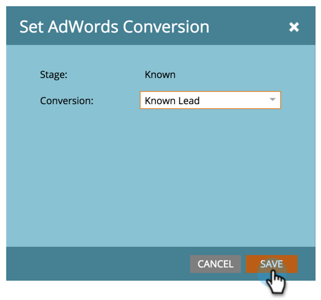

# Google AdWords-conversies instellen in het inkomstenmodel {#set-google-adwords-conversions-in-the-revenue-model}

Koppel uw Google AdWords-account aan Marketo om offline conversiegegevens van Marketo automatisch te uploaden naar Google AdWords. Dan, van AdWords UI, zult u gemakkelijk kunnen zien welke klikken in gekwalificeerde lood, kansen en nieuwe klanten (of welke opbrengststadia u wilt volgen) nadat u [douanekolommen](https://support.google.com/adwords/answer/3073556) in AdWords toevoegt.

>[!NOTE]
>
>Dit is een push-integratie van Marketo in Google AdWords. Conversiegegevens worden _alleen_ weergegeven in uw Google AdWords-portal, _niet in de Marketo-gebruikersinterface_.

Meer informatie over de functie voor het importeren van offlineconversies van Google](https://support.google.com/adwords/answer/2998031?hl=en). [ Wijs AdWords off-line omzettingen aan één of meerdere stadia in een model van de Inkomsten toe. U kunt de toewijzing op drie manieren uitvoeren:

* Advertentieconversie
* Werkgebiedactie
* Toewijzing van adWoorden

U kunt nieuwe AddWords off-line omzetting van Marketo tot stand brengen als u de Actie van het Stadium gebruikt.

>[!PREREQUISITES]
>
>[Google AdWords toevoegen als een LaunchPoint-service](/help/marketo/product-docs/administration/additional-integrations/add-google-adwords-as-a-launchpoint-service.md)

## Advertentieconversie {#use-adwords-conversion} gebruiken

1. Ga naar het gebied **Analytics**.

   

1. Selecteer een model.

   

1. Klik **Concept bewerken**.

   

1. Selecteer de inkomstenfase u aan een omzetting wilt in kaart brengen AdWords.

   

1. Selecteer **AdWords Conversion** u aan uw stadium van het Marketo in kaart wilt brengen.

   

   Mooi! De conversiegegevens van de Advertentie-woorden worden geüpload naar uw Google AdWords in de door u geselecteerde tijdslijn.

## Werkgebiedhandeling gebruiken {#use-stage-action}

U kunt ook een ADW-conversie toewijzen onder Werkgebiedhandelingen.

1. Selecteer de stap u aan een omzetting wilt in kaart brengen AdWords.

   

1. Selecteer **AdWords-conversie instellen** onder de vervolgkeuzelijst **Werkgebiedhandelingen**.

   

1. Selecteer een **AdWords-conversie**.

   

   **Tip**: Als u geen omzettingen AdWords hebt, creeer één door  **+Nieuwe Omzetting** te klikken.

   

1. Klik **Opslaan**.

   

1. Nadat u klaar bent met het in kaart brengen van al uw omzettingen AdWords in opbrengststadia, ga terug naar de summiere pagina. Selecteer **Modelhandelingen** en kies **Fagen goedkeuren**.

   

## Pro-tip: Nieuwe conversie toevoegen {#pro-tip-add-a-new-conversion}

Pro tip! Van Marketo kan een nieuwe offline conversie van AdWords worden gemaakt.

>[!CAUTION]
>
>Nieuwe omzettingen die zijn gemaakt met Marketo hebben de instelling voor optimalisatie ingeschakeld. Dit betekent dat Advertentiestrategieën worden toegestaan om uw biedingen voor die omzettingen te optimaliseren. U kunt deze instelling wijzigen vanuit uw AdWords-account.

1. Selecteer **AdWords-conversie instellen** onder de vervolgkeuzelijst **Werkgebiedhandelingen**.

   

1. Selecteer **Nieuwe omzetting**.

   

1. Voer een **Conversienaam** in. Klik **Opslaan**.

   

   Uitstekend! Deze nieuwe conversie wordt weergegeven in uw AdWords-account.

## Toewijzing van ADW-woorden gebruiken {#use-adwords-mapping}

U kunt al uw modelstadia met uw Conversie AdWords in één plaats associëren gebruikend Toewijzingen AdWords.

1. Selecteer **AdWords Mappings** bewerken.

   

1. Selecteer de gewenste **AdWords Conversion** voor elk stadium dat u wilt volgen.

   

1. Zodra u uw stadia hebt in kaart gebracht, klik **sparen**.

   

1. Nadat u klaar bent met het in kaart brengen van al uw omzettingen AdWords in opbrengststadia, ga terug naar de summiere pagina. Selecteer **Modelhandelingen** en kies **Fagen goedkeuren**.

   

Als u de gegevens van de offline conversie wilt weergeven, moet u zich aanmelden bij uw AdWords-account. Wij adviseren u hun [eigenschap van de Kolommen van de Douane ](https://support.google.com/adwords/answer/3073556) gebruiken om omzettelkolommen voor elke off-line omzetting tot stand te brengen u van Marketo invoert.
