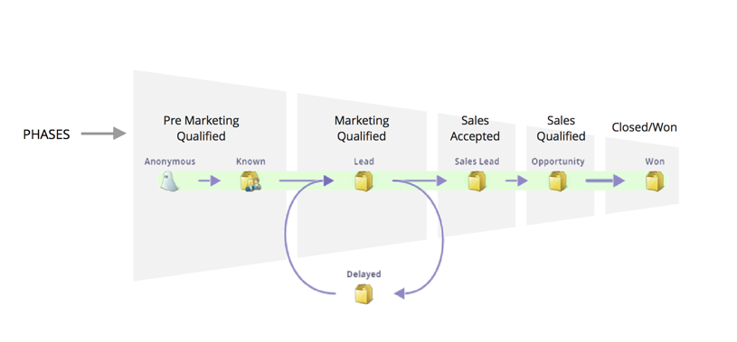

# Begrijpen van omzetmodelfasen {#understanding-revenue-model-phases}

In fasen kunt u een aantal fasen groeperen. Soms weerspiegelen meerdere fasen in een model één fase van een trechter.

## Definieer de fasen van het model {#define-the-phases-of-the-model}

1. Klik **Fases**.

   

1. Klik op de blauwe knop om de fasen omhoog en omlaag te slepen.

   
