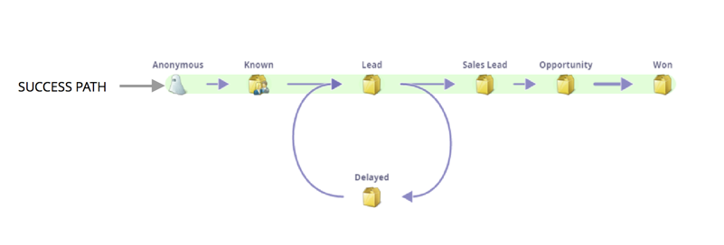

# Succespad van inkomstenmodel {#understanding-revenue-model-success-path}

## Pad met succes {#success-path}

In het model, is de groene weg ook de **Weg van het Succes** de optimale weg van hoe een lood lineaire overgangen naar gesloten/wonende zaken.

Voorbeelden van stappen op een pad met succes:

| **NAAM PADWERKGEBIED SUCCESVOEGEN** | **DEFINITIE** |
|---|---|
| **Nieuwe namen bekijken** | Controleren of nieuwe namen zijn gekwalificeerd |
| **Perspectief** | Gekwalificeerde vooruitzichten die nog niet klaar zijn voor verkoop |
| **Lood** | Gerelateerde leads voor marketing (&quot;gereed voor verkoop&quot;) |
| **Opportunity** | Verkoop geaccepteerde leads, actief werken |
| **Klant** | Gesloten deals |

>[!TIP]
>
>Groen is voor geld. Alles op de weg naar groen is op weg naar succes! Daarom zijn er slechts groene pijlen in [Success de Analysator van de Weg](using-the-success-path-analyzer.md).

## Details {#detours}

Erkennend dat niet alle leads een lineair &quot;succespad&quot; volgen, zou u ook uw &quot;omslagfasen&quot;moeten bepalen om lood te vangen die niet gekwalificeerd zijn, of die een paar rondes van het voeden vereisen alvorens klaar te worden. Bijvoorbeeld:

| **NAAM DETOUR-WERKGEBIED** | **DEFINITIE** |
|---|---|
| **Geweigerd** | Namen die zijn gemarkeerd als niet-inprofiel |
| **Inactief** | Vooruitzichten die niet zijn gereageerd |
| **Gerecycled** | Gekwalificeerd maar vereist meer verpleegkunde (gekoppeld aan perspectief) |
| **Verloren** | Verloren kansen (doorlopende verzorging) |

>[!TIP]
>
>Deze staan niet op het groene pad. Deze stadia zullen niet in de Analysator van de Weg van het Succes worden getoond.

Het zal veel gemakkelijker zijn te zien hoe de ontwikkelingen in de toekomst zullen doorlopen. Doe de groeten aan je nieuwe vriend.
