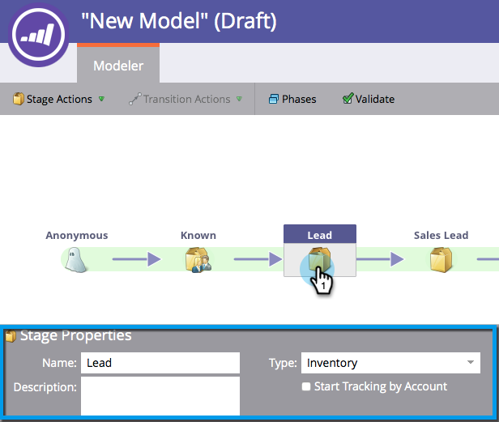
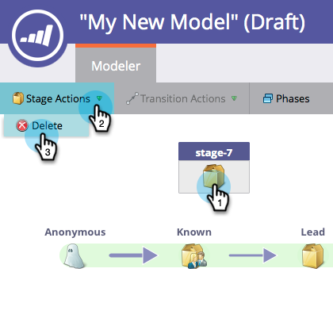

# Opbrengstmodelinventarisatiestadia gebruiken {#using-revenue-model-inventory-stages}

Alle bekende leads en accounts bevinden zich aanvankelijk in de voorraadfase. Deze perspectiefpool is waar de leiders worden gevoed tot de verkoop klaar is. Er is geen tijdslimiet voor een inventarisfase.

>[!TIP]
>
>Het is een goed idee om een praktijkmodel te maken in een grafisch of presentatieprogramma en dit eerst met uw collega&#39;s te bevestigen.

## Een inventarisatiegebied toevoegen {#add-an-inventory-stage}

1. Als u een nieuwe fase in de Inventaris van de inkomstencyclusmodellen wilt toevoegen, klikt u op de knop **[!UICONTROL Analytics]** in het **[!UICONTROL My Marketo]** -beginscherm.

   

1. In de **[!UICONTROL Analytics]** sectie, selecteer uw bestaand model, of [ creeer nieuwe ](/help/marketo/product-docs/reporting/revenue-cycle-analytics/revenue-cycle-models/create-a-new-revenue-model.md).

   

1. Klik op **[!UICONTROL Edit Draft]**.

   

1. Als u een nieuw inventariswerkgebied wilt toevoegen, klikt u op de knop **[!UICONTROL Inventory]** en sleept u het werkgebied naar een willekeurige locatie op het canvas.

   

1. U kunt de **[!UICONTROL Name]** bewerken, een **[!UICONTROL Description]** toevoegen en de **[!UICONTROL Type]** aanpassen nadat u een werkgebied hebt toegevoegd. U kunt nu ook **[[!UICONTROL Start Tracking by Account]](/help/marketo/product-docs/reporting/revenue-cycle-analytics/revenue-cycle-models/start-tracking-by-account-in-the-revenue-modeler.md)** selecteren.

   

## Een inventarisgebied bewerken {#edit-an-inventory-stage}

Als u een inventarisatiepictogram selecteert, kunt u de **[!UICONTROL Name]** bewerken, een **[!UICONTROL Description]** toevoegen of de **[!UICONTROL Type]** aanpassen. U kunt ook [[!UICONTROL Start Tracking by Account]](/help/marketo/product-docs/reporting/revenue-cycle-analytics/revenue-cycle-models/start-tracking-by-account-in-the-revenue-modeler.md) selecteren.

1. Klik op een pictogram **[!UICONTROL Inventory]** .

   

1. Klik in de velden **[!UICONTROL Name]** en **[!UICONTROL Description]** om de inhoud ervan te bewerken.

   

1. Selecteer de keuzelijst **[!UICONTROL Type]** die u wilt bewerken.

   

## Een inventarisatiegebied verwijderen {#delete-an-inventory-stage}

1. U kunt een inventarisgebied verwijderen door met de rechtermuisknop op het pictogram van een overzichtswerkgebied te klikken of de controle uit te voeren.

   

1. U kunt een werkgebied ook verwijderen door erop te klikken en vervolgens in het vervolgkeuzemenu **[!UICONTROL Stage Actions]** de optie **[!UICONTROL Delete]** te selecteren.

   

1. Beide methodes van schrapping vragen u om uw keus te bevestigen. Klik op **[!UICONTROL Delete]**.

   

Gefeliciteerd! Nu begrijp je de geweldige wereld van inventarisatiestappen.
