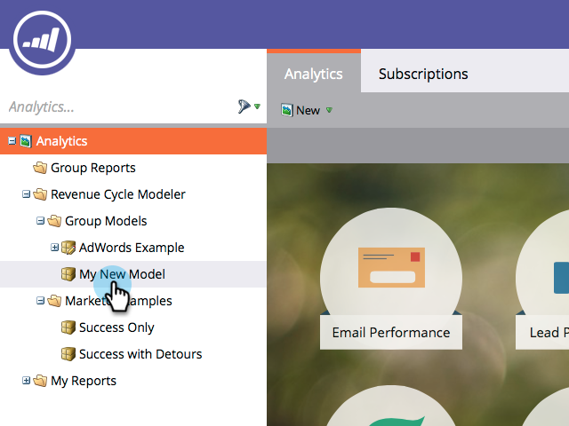
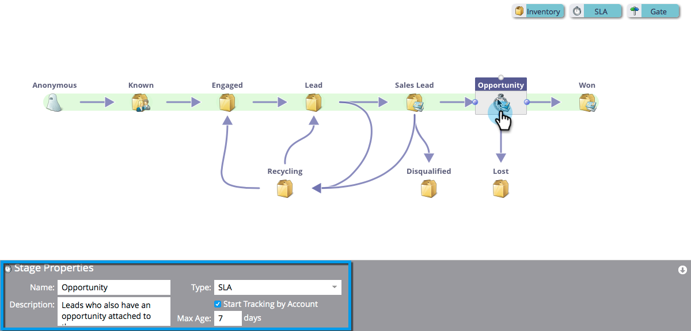

# SLA-fasen met inkomstenmodel gebruiken {#using-revenue-model-sla-stages}

SLA staat voor &quot;service level agreement&quot;. Deze fasen worden gebruikt wanneer er een bepaalde maximumtijd is waarin een lood moet worden geëvalueerd of verwerkt alvorens vooruit of uit het proces te bewegen.

>[!TIP]
>
>Het is een goed idee om een praktijkmodel in een grafisch of presentatieprogramma te creëren en het met uw collega&#39;s te bevestigen.

## Een SLA-werkgebied toevoegen {#add-an-sla-stage}

1. Als u een nieuw werkgebied van de Opbrengstcyclus Model SLA wilt toevoegen, klikt u op de knop **[!UICONTROL Analytics]** in het [!UICONTROL My Marketo] -beginscherm.

   

1. In de [!UICONTROL Analytics] sectie, selecteer uw bestaand model, of [ creeer nieuwe ](/help/marketo/product-docs/reporting/revenue-cycle-analytics/revenue-cycle-models/create-a-new-revenue-model.md).

   

1. Klik op **[!UICONTROL Edit Draft]**.

   

1. Als u een nieuw SLA-werkgebied wilt toevoegen, klikt u op de knop **[!UICONTROL SLA]** en sleept u het werkgebied naar een willekeurige locatie op het canvas.

   

1. U kunt de **[!UICONTROL Name]** bewerken, een **[!UICONTROL Description]** toevoegen en de **[!UICONTROL Type]** aanpassen nadat u een werkgebied hebt toegevoegd. U kunt nu ook **[[!UICONTROL Start Tracking by Account]](/help/marketo/product-docs/reporting/revenue-cycle-analytics/revenue-cycle-models/start-tracking-by-account-in-the-revenue-modeler.md)** selecteren.

   

## Een SLA-werkgebied bewerken {#edit-an-sla-stage}

Als u een SLA-werkgebiedpictogram selecteert, kunt u de **[!UICONTROL Name]** bewerken, een **[!UICONTROL Description]** toevoegen en de **[!UICONTROL Type]** aanpassen. U kunt ook [[!UICONTROL Start Tracking by Account]](/help/marketo/product-docs/reporting/revenue-cycle-analytics/revenue-cycle-models/start-tracking-by-account-in-the-revenue-modeler.md) selecteren.

1. Klik op een SLA-werkgebiedpictogram.

   

1. Klik in de velden **[!UICONTROL Name]** en **[!UICONTROL Description]** om de inhoud ervan te bewerken.

   

1. Selecteer de pull-down **[!UICONTROL Type]** om uit te geven.

   

## Een SLA-werkgebied verwijderen {#delete-an-sla-stage}

1. U kunt een SLA-werkgebied verwijderen door met de rechtermuisknop te klikken of Control ingedrukt te houden en te klikken op het SLA-werkgebiedpictogram.

   

1. U kunt een werkgebied ook verwijderen door erop te klikken en vervolgens in de vervolgkeuzelijst **[!UICONTROL Stage Actions]** de optie **[!UICONTROL Delete]** te selecteren.

   
