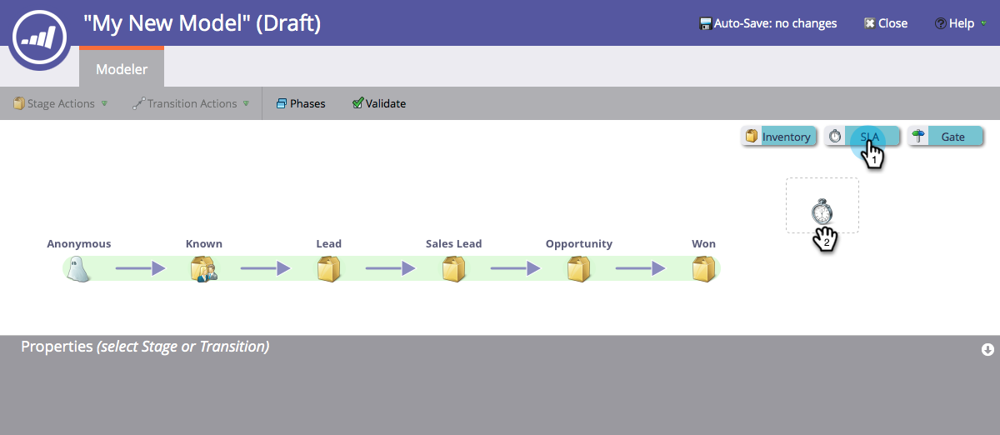

# SLA-stadia van inkomstenmodel gebruiken {#using-revenue-model-sla-stages}

SLA staat voor &quot;service level agreement&quot;. Deze fasen worden gebruikt wanneer er een bepaalde maximumtijd is waarin een lood moet worden geëvalueerd of verwerkt alvorens vooruit of uit het proces te bewegen.

>[!TIP]
>
>Het is een goed idee om een praktijkmodel in een grafisch of presentatieprogramma te creëren en het met uw collega&#39;s te bevestigen.

## Een SLA-werkgebied toevoegen {#add-an-sla-stage}

1. Als u een nieuw SLA-werkgebied van een inkomstencyclusmodel wilt toevoegen, klikt u op de knop **Analytics** in het startscherm van Mijn Marketo.

   

1. Selecteer in de sectie Analytics uw bestaande model of [maak een nieuw model](/help/marketo/product-docs/reporting/revenue-cycle-analytics/revenue-cycle-models/create-a-new-revenue-model.md).

   

1. Klik **Concept bewerken**.

   

1. Als u een nieuw SLA-werkgebied wilt toevoegen, klikt u op de knop **SLA** en sleept u het werkgebied naar een willekeurige locatie op het canvas.

   

1. U kunt de **Naam** bewerken, een **Beschrijving** toevoegen en het **Type** aanpassen nadat u een werkgebied hebt toegevoegd. U kunt **[Beginnen met bijhouden via account](/help/marketo/product-docs/reporting/revenue-cycle-analytics/revenue-cycle-models/start-tracking-by-account-in-the-revenue-modeler.md)** op dit moment ook selecteren.

   

## Een SLA-werkgebied bewerken {#edit-an-sla-stage}

Als u een SLA-werkgebiedpictogram selecteert, kunt u de naam bewerken, een beschrijving toevoegen en het type aanpassen. U kunt [Beginnen met bijhouden via account](/help/marketo/product-docs/reporting/revenue-cycle-analytics/revenue-cycle-models/start-tracking-by-account-in-the-revenue-modeler.md) ook selecteren.

1. Klik op een SLA-werkgebiedpictogram.

   

1. Klik binnen **Naam** en **Beschrijving** gebieden om hun inhoud uit te geven.

   

1. Selecteer **Typ** pull-down om uit te geven.

   

## Een SLA-werkgebied {#delete-an-sla-stage} verwijderen

1. U kunt een SLA-werkgebied verwijderen door met de rechtermuisknop te klikken of Control ingedrukt te houden en te klikken op een SLA-werkgebiedpictogram.

   

1. U kunt een werkgebied ook verwijderen door erop te klikken en vervolgens in de vervolgkeuzelijst Werkgebiedhandelingen de optie Verwijderen te selecteren.

   
