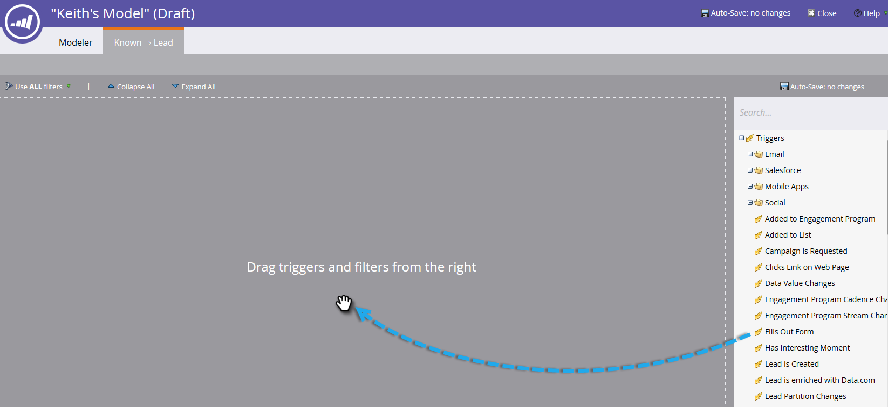

# Overgangen naar inkomstenmodel gebruiken {#using-revenue-model-transitions}

>[!PREREQUISITES]
>
>[Een nieuw inkomstenmodel maken](/help/marketo/product-docs/reporting/revenue-cycle-analytics/revenue-cycle-models/create-a-new-revenue-model.md)

Wanneer u uw model creeert en uw inventarisstadia selecteert en organiseert, is het tijd om de overgangen te plaatsen.

1. Klik met de rechtermuisknop (u kunt ook dubbelklikken) op een van de pijlen om aan de slag te gaan en selecteer **Overgang bewerken**.

   

   >[!NOTE]
   >
   >De overgangsregels &#39;Anoniem bekend&#39; kunnen niet worden bewerkt.

1. Er wordt een nieuw tabblad geopend voor de overgang die u hebt geselecteerd.

   

1. Overgangen bepalen hoe de leads naar een ander stadium gaan. Sleep de trigger (of het filter) van uw keuze van rechts naar rechts en laat deze los op het canvas. In dit voorbeeld selecteren we de trigger Formulier invullen uit.

   >[!TIP]
   >
   >Omdat de opbrengstmodellen u opstelling voor rapportering zijn, adviseert men dat de overgangen altijd trekkers omvatten. Zo weerspiegelen uw rapporten de ware snelheid van uw model/werkgebiedstroom. U kunt filters toevoegen met de triggers voor extra beperkingen.

   

1. Kies de parameter(s) voor de geselecteerde trigger/filter.

   

1. Om terug naar uw model te krijgen, klik **Modelleur**.

   

1. Onder aan het scherm ziet u nu de overgangsregels.

   

1. Zodra u regels voor al uw overgangen hebt gevormd, klik **Valideren** om te verifiëren.

   

1. Indien correct gedaan, zult u het volgende bericht zien.

   

Goed gedaan! U hebt met succes uw modelovergangen gewijzigd.

>[!MORELIKETHIS]
>
>[Een inkomstenmodel goedkeuren/goedkeuren](/help/marketo/product-docs/reporting/revenue-cycle-analytics/revenue-cycle-models/approve-unapprove-a-revenue-model.md)
