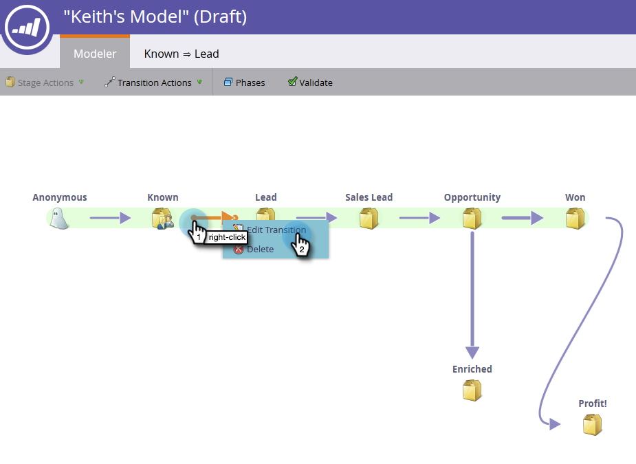

# Overgangen met inkomstenmodellen gebruiken {#using-revenue-model-transitions}

>[!PREREQUISITES]
>
>[ creeer een Nieuw Model van de Opbrengst ](/help/marketo/product-docs/reporting/revenue-cycle-analytics/revenue-cycle-models/create-a-new-revenue-model.md)

Wanneer u uw model creeert en uw inventarisstadia selecteert en organiseert, is het tijd om de overgangen te plaatsen.

1. Klik met de rechtermuisknop (u kunt ook dubbelklikken) op een van de pijlen om aan de slag te gaan en selecteer **[!UICONTROL Edit Transition]** .

   

   >[!NOTE]
   >
   >Overgangsregels &#39;[!UICONTROL Anonymous] [!UICONTROL Known]&#39; kunnen niet worden bewerkt.

1. Er wordt een nieuw tabblad geopend voor de geselecteerde overgang.

   

1. Overgangen bepalen hoe de leads naar een ander stadium gaan. Sleep de trigger (of het filter) van uw keuze van rechts naar rechts en laat deze los op het canvas. In dit voorbeeld wordt de trigger **[!UICONTROL Fills Out Form]** geselecteerd.

   >[!TIP]
   >
   >Omdat de opbrengstmodellen u opstelling voor rapportering zijn, adviseert men dat de overgangen altijd trekkers omvatten. Zo weerspiegelen uw rapporten de ware snelheid van uw model/werkgebiedstroom. U kunt filters toevoegen met de triggers voor extra beperkingen.

   

1. Kies de parameter(s) voor de geselecteerde trigger/filter.

   

1. Klik op **[!UICONTROL Modeler]** om terug te keren naar uw model.

   

1. Onder aan het scherm ziet u nu de overgangsregels.

   

1. Zodra u regels voor al uw overgangen hebt gevormd, klik **[!UICONTROL Validate]** om te verifiëren.

   

1. Indien correct gedaan, zult u het volgende bericht zien.

   

Goed gedaan! U hebt met succes uw modelovergangen gewijzigd.

>[!MORELIKETHIS]
>
>[ keur/keurt een Model van de Opbrengst goed ](/help/marketo/product-docs/reporting/revenue-cycle-analytics/revenue-cycle-models/approve-unapprove-a-revenue-model.md)
