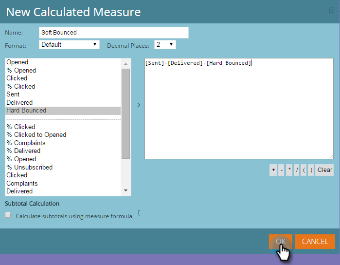

# Aangepaste maatregelen toevoegen aan een rapport van de Ontdekkingsreiziger van de Inkomsten {#adding-custom-measures-to-a-revenue-explorer-report}

Soms wilt u een aangepaste maatregel in een rapport. Het is eenvoudig om je eigen te maken.

In het onderstaande voorbeeld, creeert u een berekende maatregel voor zachte grenzen, die metriek reeds in het rapport neemt en basiswiskunde gebruikt om nieuwe metrisch tot stand te brengen. U kunt ook andere soorten metingen maken.

>[!PREREQUISITES]
>
>U hebt minstens één metrisch in uw rapport nodig, maar het moet niet één van de maatregelen zijn u gebruikt om uw douanemaatregel te bepalen.

1. Trek over de gebieden u voor uw rapport nodig hebt. Zie [ Toevoegend Gebieden aan een Rapport van de Ontdekkingsreiziger van de Opbrengst ](/help/marketo/product-docs/reporting/revenue-cycle-analytics/revenue-explorer/adding-fields-to-a-revenue-explorer-report.md) voor details.

1. Klik met de rechtermuisknop op een bestaande metrische waarde (blauwe cel), klik op **[!UICONTROL User Defined Measure]** en selecteer **[!UICONTROL Calculated Measure]** .

   

1. Geef een naam op voor de aangepaste maat en selecteer een indeling.

   

1. Klik op elk onderdeel dat u aan de linkerkant nodig hebt en klik op de pijl om het te verplaatsen. Voeg naar wens wiskundige symbolen toe.

   

   >[!TIP]
   >
   >U kunt de wiskundige symbolen zelf typen of het selectievak gebruiken.

1. Klik op **[!UICONTROL OK]** als u klaar bent.

   

   Uw nieuwe aangepaste maatregel wordt als een nieuwe kolom in het rapport weergegeven.

   

   >[!MORELIKETHIS]
   >
   >[ Toevoegend Gebieden aan een Rapport van de Ontdekkingsreiziger van de Opbrengst ](/help/marketo/product-docs/reporting/revenue-cycle-analytics/revenue-explorer/adding-fields-to-a-revenue-explorer-report.md)
