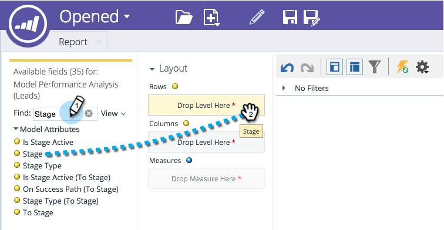

# Velden toevoegen aan een Indelingsverkenner-rapport {#adding-fields-to-a-revenue-explorer-report}

Pas de rapporten van de opbrengstontdekkingsreiziger door afmeting en metrische gebieden in het canvas te slepen en te laten vallen.

<table>
 <tbody>
  <tr>
   <th>Veldtype</th>
   <th>Beschrijving</th>
  </tr>
  <tr>
   <td>Geel veld of Dimension</td>
   <td>
De gele gebieden zijn de afmetingen (rijen en kolommen) van uw rapport.

U kunt bijvoorbeeld een rapport maken waarin de status van de lead of de aanmaakdatum in kolommen wordt weergegeven.
</td>
  </tr>
  <tr>
   <td>Blauw veld of meting</td>
   <td>
Blauwe velden zijn metriek die in de gegevens worden geanalyseerd.

Dit kan bijvoorbeeld de gemiddelde leadscore voor uw leads zijn, of het aantal dagen dat een lead de kans heeft gehad.
</td>
  </tr>
 </tbody>
</table>

1. Zoek de gele velden die u wilt gebruiken en sleep deze naar Rijen.

   

   >[!TIP]
   >
   >Houd de muisaanwijzer boven een veld voor een volledige beschrijving.

1. Zoek de blauwe velden die u wilt gebruiken en sleep deze naar Metingen.

   

   Geweldig! Nu heb je een volwaardig rapport!

   

>[!MORELIKETHIS]
>
>[&#x200B; Deleting a Gebied in een Rapport van de Ontdekkingsreiziger van de Opbrengst &#x200B;](/help/marketo/product-docs/reporting/revenue-cycle-analytics/revenue-explorer/deleting-a-field-in-a-revenue-explorer-report.md)
