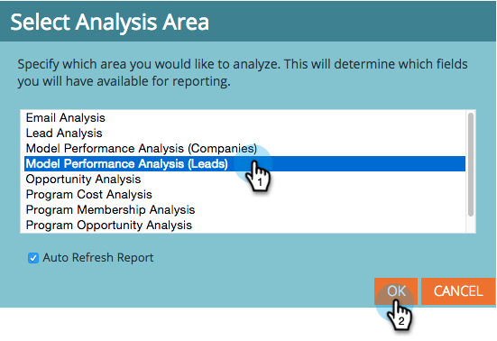

# Een [!UICONTROL Revenue Explorer] -rapport maken {#create-a-revenue-explorer-report}

Met het [!UICONTROL Revenue Explorer] -rapport kunt u het investeringsrendement voor uw marketinginitiatieven bijhouden.

>[!AVAILABILITY]
>
>Niet alle Marketo Engage-gebruikers hebben deze functionaliteit aangeschaft. Neem contact op met het Adobe-accountteam (uw accountmanager) voor meer informatie.

>[!IMPORTANT]
>
>De prullenmand in Revenue Cycle Explorer is tijdelijk verborgen vanwege een technisch probleem. We werken momenteel aan een oplossing en uw bestanden zijn veilig. Gelieve te contacteren {de Steun van 0} Adobe [ als er om het even welke dossiers zijn u moet worden hersteld.](https://nation.marketo.com/t5/support/ct-p/Support)

1. Ga naar het **[!UICONTROL Revenue Explorer]** -gebied.

   

1. Klik op **[!UICONTROL Create New]** en selecteer vervolgens **[!UICONTROL Report]** .

   

1. Kies een type rapport.

   

   Geweldig! Je hebt officieel een rapport gemaakt. Tijd om aan te passen door enkele velden toe te voegen!

   

>[!MORELIKETHIS]
>
>* [ Toevoegend Gebieden aan a [!UICONTROL Revenue Explorer] Rapport ](/help/marketo/product-docs/reporting/revenue-cycle-analytics/revenue-explorer/adding-fields-to-a-revenue-explorer-report.md)
>* [ Toevoegend de Maatregelen van de Douane aan a [!UICONTROL Revenue Explorer] Rapport ](/help/marketo/product-docs/reporting/revenue-cycle-analytics/revenue-explorer/adding-custom-measures-to-a-revenue-explorer-report.md)
