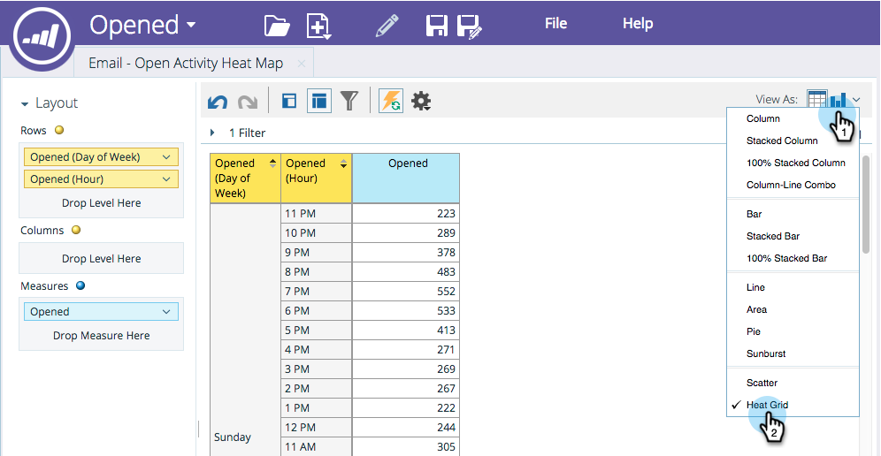

# Heatrasters aanpassen en weergeven {#customize-and-display-heat-grids}

Een warmteraster geeft uw gegevens visueel weer in een gekleurd raster, zodat u goede en slechte patronen gemakkelijker en sneller kunt herkennen.

1. Klik in uw rapport op het diagrampictogram en vervolgens op **[!UICONTROL Heat Grid]** .

   

1. Ga naar het **[!UICONTROL Heat Grid]** -gebied als u wijzigingen wilt aanbrengen in uw **[!UICONTROL Properties]** .

   

   Geweldig! U hebt nu uw **[!UICONTROL Heat Grid]**!
