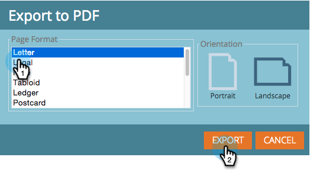

# Een [!UICONTROL Revenue Explorer] -rapport exporteren {#exporting-a-revenue-explorer-report}

U kunt om het even welk rapport van de opbrengstontdekkingsreiziger uitvoeren en het met iedereen delen.

1. Klik op het pictogram Vistuig, selecteer **[!UICONTROL Export]** en selecteer een bestandsindeling.

   

   >[!NOTE]
   >
   >U kunt een rapport naar de volgende drie formaten uitvoeren:
   >
   >* PDF
   >* [!DNL Excel]
   >* CSV

1. Selecteer de gewenste **[!UICONTROL Page Format]** en **[!UICONTROL Orientation]** en klik op **[!UICONTROL Export]** .

   

   Zoet! Stuur dit bestand rond en druk op uw collega&#39;s met uw ninja-achtige marketingvaardigheden.

>[!MORELIKETHIS]
>
>[ Abonneren aan a [!UICONTROL Revenue Explorer] Rapport ](/help/marketo/product-docs/reporting/revenue-cycle-analytics/revenue-explorer/subscribe-to-a-revenue-explorer-report.md)
