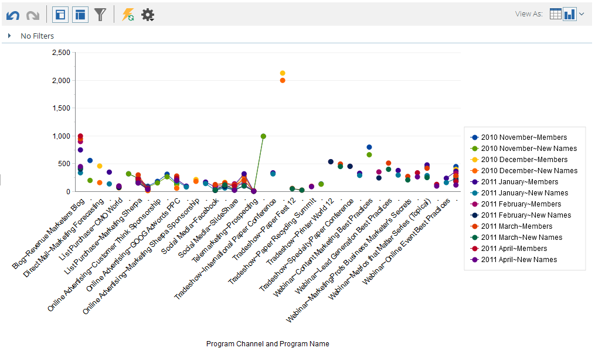
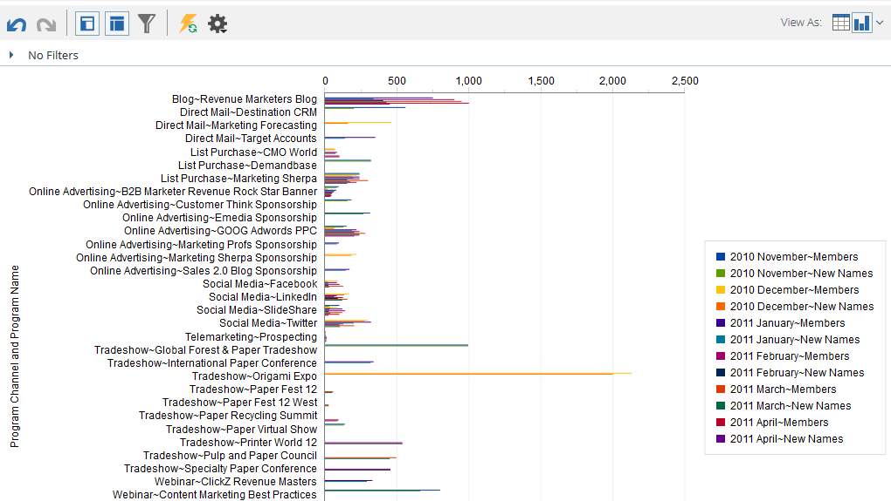
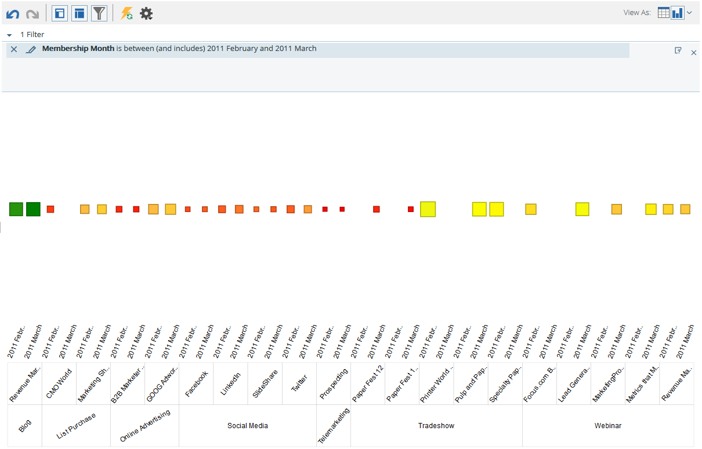

# Afbeeldingsresultaten van [!UICONTROL Revenue Explorer] {#graphing-results-from-revenue-explorer}

Standaard worden rapporten in [!UICONTROL Revenue Explorer] weergegeven als een tabel. U kunt de resultaten ook weergeven als een grafiek in verschillende indelingen.

1. Klik op de pijl in de vervolgkeuzelijst **[!UICONTROL View As]** van uw rapport. Er worden verschillende grafische opties weergegeven.

   

## Grafiekvoorbeelden {#graph-examples}

**[!UICONTROL Column]**: Elke rij en kolom in de tabel wordt weergegeven als een verticale kolom.

**[!UICONTROL Stacked Column]**: elke rij in de tabel heeft één kolom in de grafiek.

**[!UICONTROL 100% Stacked Column]**: Elke rij in de tabel heeft één kolom in de grafiek en wordt geschaald naar 100%.

**[!UICONTROL Line]**: Elke kolom wordt weergegeven als een lijn en elke rij als een gegevenspunt op de regel.

**[!UICONTROL Column-Line Combo]**: combinatie van [!UICONTROL Column] - en [!UICONTROL Line] -grafieken.

**[!UICONTROL Bar]**: elke rij en kolom in de tabel wordt weergegeven als een horizontale balk.

**[!UICONTROL Stacked Bar]**: elke rij in de tabel heeft één rij in de grafiek.

**[!UICONTROL 100% Stacked Bar]**: elke rij in de tabel heeft één rij in de grafiek en wordt geschaald naar 100%.

**[!UICONTROL Area]**: gegevens worden weergegeven op een gestapelde balk, maar worden ingevuld.

**[!UICONTROL Pie]**: Elke kolom wordt weergegeven als een cirkeldiagram, elke rij als een segment.

**[!UICONTROL Sunburst]**: radiale grafiek die kenmerken in segmenten vertegenwoordigt.

**[!UICONTROL Scatter]**: bellen op basis van gebruikte kenmerken. Gebruik maateenheden om de bel te kleuren en/of de grootte ervan te bepalen.

**[!UICONTROL Heat Grid]**: pas kleuren en vormen aan om positieve en negatieve prestatiepatronen te identificeren.

1. Klik op de tabelknop om terug te gaan naar de tabelweergave.

   
