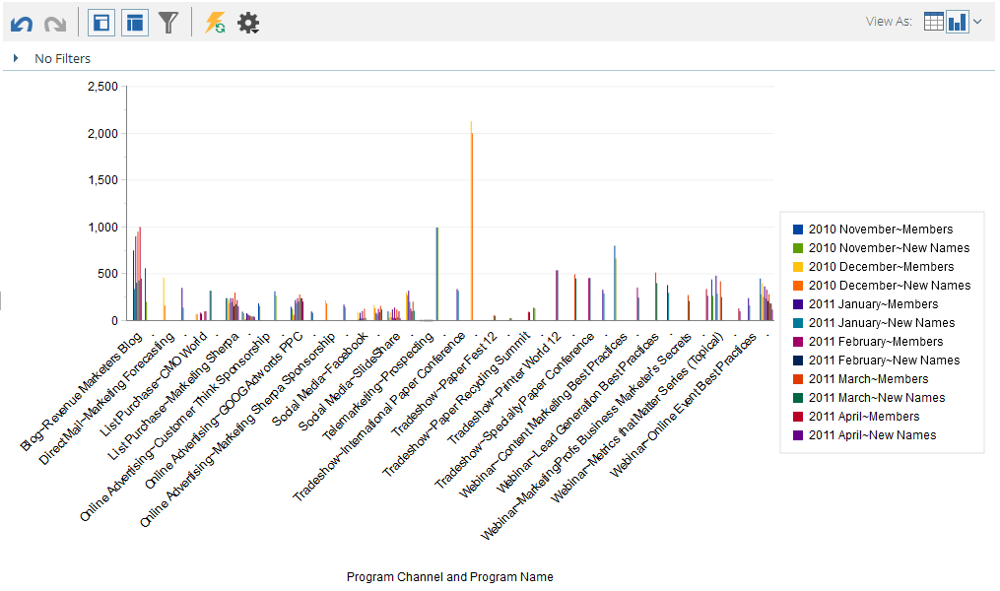

# Grafiekresultaten van de Ontdekkingsreiziger van de Inkomsten {#graphing-results-from-revenue-explorer}

Standaard worden rapporten in Indelingsverkenner weergegeven als een tabel. U kunt de resultaten ook weergeven als een grafiek in verschillende indelingen.

1. Klik op de pijl in het dialoogvenster **Weergeven als** vervolgkeuzemenu van uw rapport. Er worden verschillende grafische opties weergegeven.

   

## Grafiekvoorbeelden {#graph-examples}

**Kolom**: Elke rij en kolom in de tabel wordt weergegeven als een verticale kolom.

**Gestapelde kolom**: Elke rij in de tabel heeft één kolom in de grafiek.

**100% gestapelde kolom**: Elke rij in de tabel heeft één kolom in de grafiek en wordt geschaald naar 100%.

**Lijn**: Elke kolom wordt weergegeven als een lijn en elke rij als een gegevenspunt op de regel.

**Kolomlijnde combinatie**: Combinatie van kolom- en lijngrafieken.

**Balk**: Elke rij en kolom in de tabel wordt weergegeven als een horizontale balk.

**Gestapelde balk**: Elke rij in de tabel heeft één rij in de grafiek.

**100% gestapelde balk**: Elke rij in de tabel heeft één rij in de grafiek en wordt geschaald naar 100%.

**Gebied**: Gegevens worden op dezelfde manier weergegeven als op Gestapelde balk, maar worden ingevuld.

**Schijf**: Elke kolom wordt weergegeven als een cirkeldiagram, elke rij als een segment.

**Zonsondergang**: Radiale grafiek die kenmerken in segmenten vertegenwoordigt.

**Spreiding**: Bubbles op basis van gebruikte kenmerken. Gebruik maateenheden om de bel te kleuren en/of de grootte ervan te bepalen.

**Warmteraster**: Pas kleuren en vormen aan om positieve en negatieve prestatiepatronen te identificeren.

1. Klik op de tabelknop om terug te gaan naar de tabelweergave.

   
