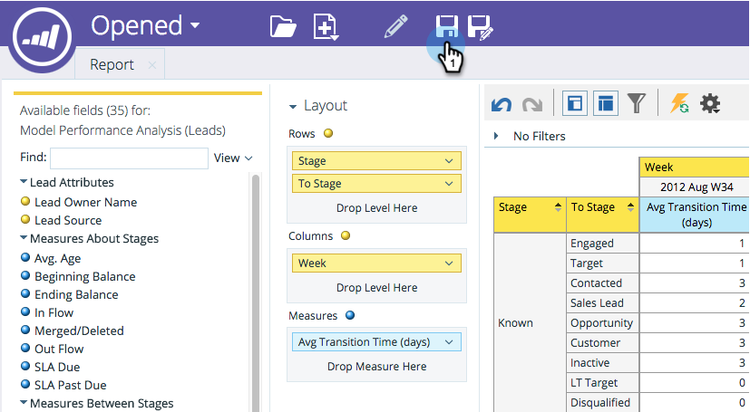
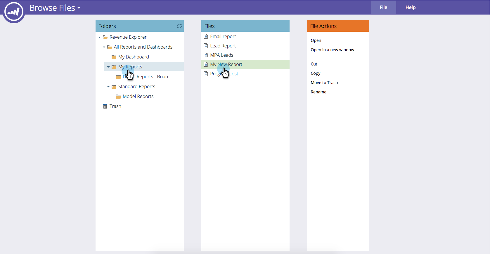

# Een [!UICONTROL Revenue Explorer] -rapport opslaan {#saving-a-revenue-explorer-report}

[!UICONTROL Revenue Explorer] -rapporten kunnen worden opgeslagen in het gewenste bestand.

1. Klik op het pictogram Opslaan.

   

   >[!NOTE]
   >
   >Wijzigingen die u in uw rapport aanbrengt, worden niet automatisch opgeslagen. Zorg er dus voor dat je vaak opslaat!

1. Geef uw rapport een beschrijvende naam, selecteer een locatie en klik op **[!UICONTROL Save]**!

   

   Dat is alles! U hebt nu toegang tot uw bestand in **[!UICONTROL Browse Files]** .

   

>[!MORELIKETHIS]
>
>[&#x200B; Abonneren aan a [!UICONTROL Revenue Explorer] Rapport &#x200B;](/help/marketo/product-docs/reporting/revenue-cycle-analytics/revenue-explorer/subscribe-to-a-revenue-explorer-report.md)
