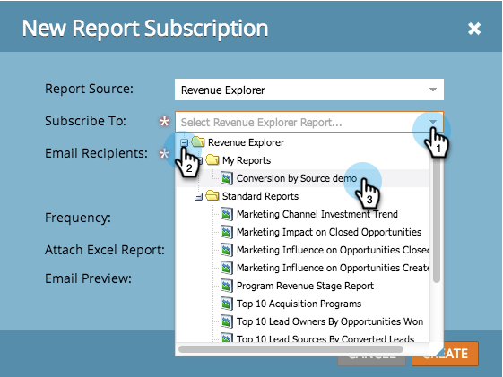

# Abonneren op een [!UICONTROL Revenue Explorer] -rapport {#subscribe-to-a-revenue-explorer-report}

Als u updates wilt ontvangen uit uw rapporten van de Inkoopcyclusverkenner en deze wilt delen, kunt u elk e-mailadres op een bestaand rapport abonneren.

1. Ga naar **[!UICONTROL Analytics]** en selecteer **[!UICONTROL New]** > **[!UICONTROL New Report Subscription]** .

   

   >[!NOTE]
   >
   >Om aan een basisrapport in te tekenen dat u in een programma creeerde, zie [ aan een BasisRapport intekenen.](/help/marketo/product-docs/reporting/basic-reporting/report-subscriptions/subscribe-to-a-basic-report.md)

1. Selecteer **[!UICONTROL Report Source]** bij **[!UICONTROL Revenue Explorer]** .

   

1. Navigeer in de mappenstructuur en selecteer het rapport.

   

1. Voer het e-mailadres of de e-mailadressen in en stel de frequentie van de e-mails in.

   

   >[!NOTE]
   >
   >Iedereen kan zich afmelden voor het rapport in de e-mail die hij ontvangt.

1. Uw abonnement is ingesteld. Als je je eigen e-mailadres hebt opgegeven, ontvang je het rapport per e-mail.

   

>[!MORELIKETHIS]
>
>Leer hoe te [ om al uw rapportabonnementen ](/help/marketo/product-docs/reporting/basic-reporting/report-subscriptions/manage-report-subscriptions.md) op één plaats te beheren.
