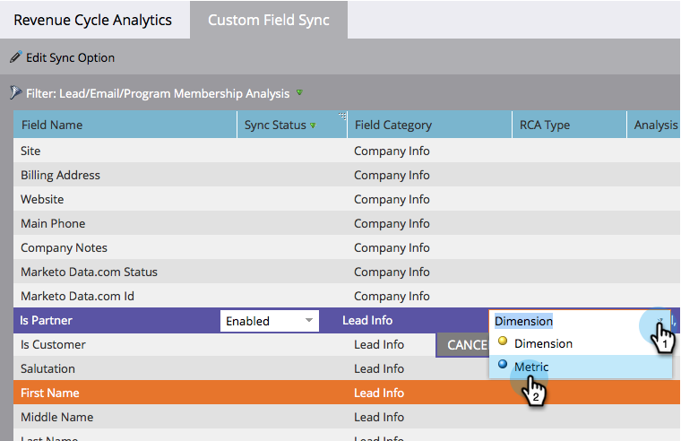

# Aangepaste velden synchroniseren met de [!UICONTROL Revenue Explorer] {#sync-custom-fields-to-the-revenue-explorer}

[!UICONTROL Revenue Cycle Analytics] kan aangepaste Marketo-velden rapporteren. Hiervoor moet u de aangepaste velden instellen die moeten worden gesynchroniseerd.

>[!NOTE]
>
>**Vereiste Bevoegdheden Admin**

1. Ga naar de sectie **[!UICONTROL Admin]** .

   

1. Selecteer **[!UICONTROL Revenue Cycle Analytics]**.

   

1. Klik op de tab **[!UICONTROL Custom Field Sync]** en kies het gewenste analysegebied.

   

1. Selecteer het veld waarvoor u synchronisatie wilt inschakelen en klik op **[!UICONTROL Edit Sync Option]** .

   

1. Wijzig **[!UICONTROL Sync Status]** in **[!UICONTROL Enabled]** .

   

1. Selecteer de **[!UICONTROL RCA Type]** van uw keuze en klik op **[!UICONTROL Save]** .

   

   >[!TIP]
   >
   >Zodra deze optie is ingeschakeld, zijn de gegevens de volgende dag beschikbaar in [!UICONTROL Revenue Cycle Analytics] .

   Mooi werk! Nu weet u hoe te om douanegebieden aan RCA toe te voegen.
