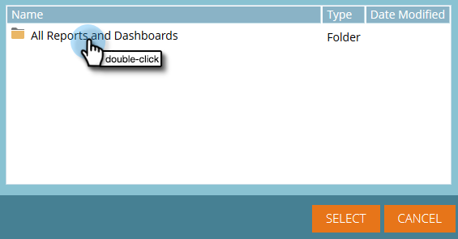
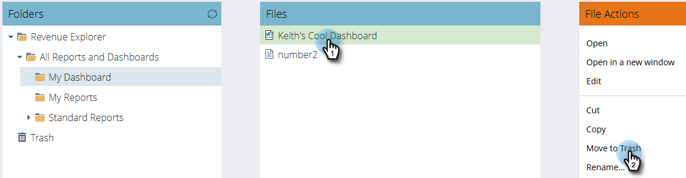

# Het gebruiken van Dashboards in Ontdekkingsreiziger {#using-dashboards-in-revenue-explorer} van de Opbrengst

Een dashboard is een combinatie rapporten van de Ontdekkingsreiziger van de Ontvangsten om een snel overzicht van uw lood, campagnes, kansen, en/of modellen te krijgen.

## Een nieuw dashboard maken {#creating-a-new-dashboard}

1. Klik **Ontdekkingsreiziger van opbrengsten**.

   

1. Klik **Nieuw maken** en vervolgens **Dashboard**.

   

1. Onder aan de pagina worden sjablonen standaard geselecteerd. Klik op de layout die u wilt gebruiken. &quot;2 Kolom&quot; wordt hier gebruikt.

   

   >[!NOTE]
   >
   >U kunt de weergave van het dashboard verder aanpassen door op **Thema&#39;s** te klikken en uw favoriet te kiezen.

1. In de eerste sectie van uw dashboard, klik **Tussenvoegsel** pictogram en selecteer **Dossier**.

   

1. Dubbelklik **Ontdekkingsreiziger van opbrengsten**.

   

1. Dubbelklik op **Alle rapporten en dashboards**.

   

1. Dubbelklik op de map met het rapport dat u wilt gebruiken.

   

1. Kies uw rapport en klik **Select**.

   

1. Het verslag zal dan vullen. Herhaal stap 4-8 voor elke resterende sectie.

   

1. Als u de naam van een sectie wilt wijzigen, klikt u op de sectie om deze te selecteren, typt u de gewenste naam onder Titel en klikt u op **Toepassen**. Herhaal deze bewerking voor elke sectie.

   

1. Als u wilt opslaan, klikt u op het pictogram Opslaan, voert u een bestandsnaam in, dubbelklikt u op de map Revenue Explorer totdat u naar de gewenste map voor het dashboard gaat en klikt u op **Opslaan**.

   

## Een dashboard {#editing-a-dashboard} bewerken

1. Klik **Ontdekkingsreiziger van opbrengsten**.

   

1. Dubbelklik op de map **Ontdekkingsreiziger van inkomsten**. Navigeer naar de plaats waar uw dashboard woont.

   

1. Selecteer het dashboard dat u wilt bewerken en klik op **Bewerken**.

   

## Een dashboard {#deleting-a-dashboard} verwijderen

1. Klik **Ontdekkingsreiziger van opbrengsten**.

   

1. Dubbelklik op de map **Ontdekkingsreiziger van inkomsten**. Navigeer naar de plaats waar uw dashboard woont.

   

1. Selecteer het dashboard dat u wilt verwijderen en klik op **Verplaatsen naar prullenmand**.

   
