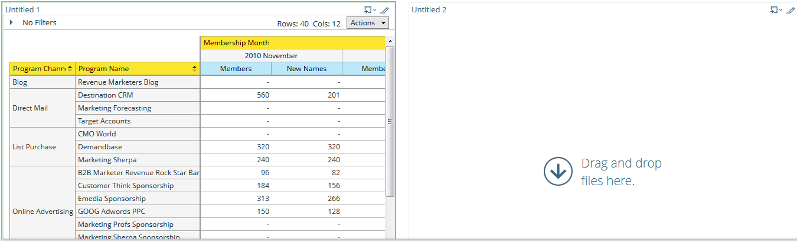

# Dashboards gebruiken in [!UICONTROL Revenue Explorer] {#using-dashboards-in-revenue-explorer}

Een dashboard is een combinatie van [!UICONTROL Revenue Explorer] -rapporten voor een snel overzicht van uw leads, campagnes, mogelijkheden en/of modellen.

## Een nieuw dashboard maken {#creating-a-new-dashboard}

1. Klik op **[!UICONTROL Revenue Explorer]**.

   

1. Klik op **[!UICONTROL Create New]** en vervolgens op **[!UICONTROL Dashboard]** .

   

1. Onder aan de pagina worden sjablonen standaard geselecteerd. Klik op de layout die u wilt gebruiken. &quot;2 Kolom&quot; wordt hier gebruikt.

   

   >[!NOTE]
   >
   >U kunt de weergave van het dashboard verder aanpassen door op **[!UICONTROL Themes]** te klikken en uw favoriet te kiezen.

1. In de eerste sectie van uw dashboard, klik het **pictogram van het Tussenvoegsel** en selecteer **[!UICONTROL File]**.

   

1. Dubbelklik op **[!UICONTROL Revenue Explorer]** .

   

1. Dubbelklik op **[!UICONTROL All Reports and Dashboards]** .

   

1. Dubbelklik op de map met het rapport dat u wilt gebruiken.

   

1. Kies uw rapport en klik op **[!UICONTROL Select]** .

   

1. Het verslag zal dan vullen. Herhaal stap 4-8 voor elke resterende sectie.

   

1. Als u de naam van een sectie wilt wijzigen, klikt u erop om de sectie te selecteren, typt u de gewenste naam onder **[!UICONTROL Title]** en klikt u op **[!UICONTROL Apply]** . Herhaal deze bewerking voor elke sectie.

   

1. Als u het bestand wilt opslaan, klikt u op het pictogram [!UICONTROL Save] , voert u een [!UICONTROL Filename] in, dubbelklikt u op de map [!UICONTROL Revenue Explorer] totdat u naar de gewenste map voor het dashboard gaat en klikt u op **[!UICONTROL Save]** .

   

## Een dashboard bewerken {#editing-a-dashboard}

1. Klik op **[!UICONTROL Revenue Explorer]**.

   

1. Dubbelklik op de map **[!UICONTROL Revenue Explorer]** . Navigeer naar de plaats waar uw dashboard woont.

   

1. Selecteer het dashboard dat u wilt bewerken en klik op **[!UICONTROL Edit]** .

   

## Een dashboard verwijderen {#deleting-a-dashboard}

1. Klik op **[!UICONTROL Revenue Explorer]**.

   

1. Dubbelklik op de map **[!UICONTROL Revenue Explorer]** . Navigeer naar de plaats waar uw dashboard woont.

   

1. Selecteer het dashboard dat u wilt verwijderen en klik op **[!UICONTROL Move to Trash]** .

   
