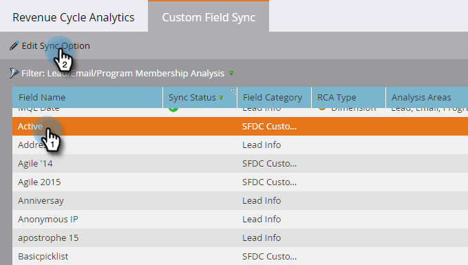

# Aangepaste veldsynchronisatie inschakelen voor [!UICONTROL Revenue Cycle Analytics] {#enabling-custom-field-sync-for-revenue-cycle-analytics}

Met de volgende stappen kunt u aangepaste velden gebruiken in RCA-rapporten.

1. Klik op **[!UICONTROL Admin]**.

   

1. Klik op **[!UICONTROL Revenue Cycle Analytics]** en vervolgens op **[!UICONTROL Custom Field Sync]** .

   

1. Selecteer uw **[!UICONTROL Field Name]** en klik op **[!UICONTROL Edit Sync Option]** .

   

1. Selecteer onder **[!UICONTROL Sync Status]** de optie **[!UICONTROL Enabled]** en klik vervolgens op **[!UICONTROL Save]** .

   

1. Met de groene controle weet u dat het veld is ingesteld op synchronisatie.

   

   En dat is dat!

   >[!NOTE]
   >
   >Nadat het veld is ingeschakeld, zijn de gegevens de volgende dag beschikbaar in [!UICONTROL Revenue Cycle Analytics] .
