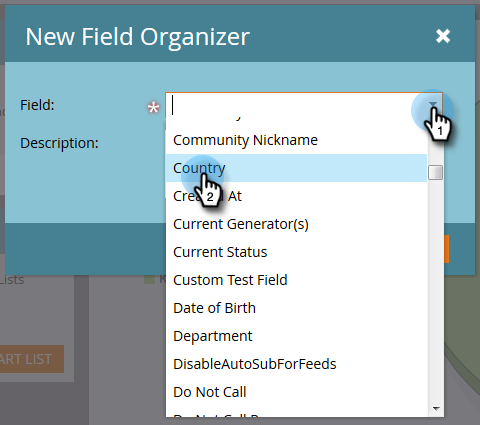

# Aangepaste veldgroepen maken met de veldOrganizer {#create-custom-field-groups-using-the-field-organizer}

Voordat u aangepaste veldgroepen kunt inschakelen voor rapportage in het gebied Modelprestatie-analyse (Leads) van Inkoopcyclusverkenner, moet u standaardvelden of aangepaste velden categoriseren in groepen voor rapportage via de veldOrganizer in Marketo Lead Management. Dit geldt alleen voor lood- en bedrijfskenmerken.
Wanneer u een standaard- of aangepast veld selecteert in de vervolgkeuzelijst Veld in het dialoogvenster Nieuwe veldOrganizer, wijst het systeem het gegevenstype Marketo Lead Management toe dat is gekoppeld aan het veld dat u wilt groeperen met een van de drie beschikbare editors in de veldOrganizer: tekenreeks, geheel getal of datum.

| Gegevenstype Marketo Lead | Gegevenstype van de veldeditor |
|---|---|
| String | String |
| E-mail | String |
| Geheel | Geheel |
| Tekst | String |
| URL | String |
| Referentie | Niet ondersteund |
| Valuta | Geheel |
| DateTime | Datum |
| Boolean | Niet ondersteund |
| Telefoon | String |
| Datum | Datum |
| Float | Geheel |
| Berekend | Niet ondersteund |

In de volgende drie secties wordt beschreven hoe u een aangepaste veldgroep maakt voor een tekenreeks, geheel getal of datumtype.

## Aangepaste veldgroep maken - Tekenreekseditor {#create-custom-field-group-string-editor}

1. Klik **Lead Database**.

   

1. Klik **Nieuw**, en selecteer **Nieuwe Organisator van het Gebied**.

   

1. Klik **Veld** en selecteer een standaard- of aangepast veld met een gegevenstype dat is toegewezen aan de tekenreekseditor (zie tabel in vorige sectie). Land wordt hier gebruikt.

   

1. Klik **Maken**.

   

   De nieuwe douanegroep toont in de boom van het Gegevensbestand van de Leiding die als Naam van het Gebied > de Groep van de Naam van het Gebied wordt vertegenwoordigd (voorbeeld: Land > Landgroep).

   

1. Klik op het potloodpictogram om de naam aan te passen. U kunt bijvoorbeeld de naam &quot;Landgroep&quot; wijzigen in &quot;Continent&quot;. Typ de gewenste nieuwe naam en klik buiten het vak om deze automatisch op te slaan.

   

1. Standaard worden alle gegevenswaarden in de subgroep &quot;Overige&quot; geplaatst. Als u de gegevenswaarden wilt categoriseren, klikt u op **Groep toevoegen** om een subgroep te maken en geeft u deze een naam.

   >[!NOTE]
   >
   >U kunt maximaal tien subgroepen toevoegen om de gegevenswaarden te categoriseren. Aan elke gemaakte subgroep wordt een id-nummer toegewezen.

   In dit voorbeeld zijn groepen gemaakt voor de meeste continenten.

   

   >[!NOTE]
   >
   >Als u een subgroep wilt verwijderen, klikt u op de rode X naast de naam van de subgroep. Als de groep gegevenswaarden bevat, worden de gegevenswaarden verplaatst naar de standaardgroep Overige.

1. Markeer een gegevenswaarde(n) op het canvas en sleep de gegevenswaarde(n) naar de juiste subgroep.

   

   >[!NOTE]
   >
   >Als u een gegevenswaarde uit een subgroep wilt verwijderen, wijst u de gegevenswaarde toe aan de standaardgroep Overige.

1. Gebruik de filteroptie in de linkerbovenhoek direct boven het canvas om de gegevenswaarden in een of meer subgroepen te selecteren en weer te geven. De gegevenswaarden op basis van de filterselectie worden op het canvas weergegeven.

   

   >[!NOTE]
   >
   >Nadat de groepen zijn gedefinieerd, kunt u de aangepaste veldgroep voor rapportage inschakelen in de modelanalyse van prestaties (lead) via het tabblad Analyse van de inkomstencyclus in Beheer van leads van Marketo.

## Aangepaste veldgroep maken - Integer-editor {#create-custom-field-group-integer-editor}

1. Klik **Lead Database**.

   

1. Klik **Nieuw**, en selecteer **Nieuwe Organisator van het Gebied**.

   

1. Klik **Veld** en selecteer een standaard- of aangepast veld met een gegevenstype dat is toegewezen aan de tekenreekseditor (zie tabel in vorige sectie). De jaarlijkse ontvangsten worden hier gebruikt.

   

1. Klik **Maken**.

   

   De nieuwe douanegroep toont in de boom van het Gegevensbestand van de Leiding die als Naam van het Gebied > de Groep van de Naam van het Gebied wordt vertegenwoordigd (voorbeeld: Jaarlijkse inkomsten > Jaarlijkse inkomstengroep).

   

1. Klik op de standaardnaam van de aangepaste groep boven de editor voor gehele getallen om de naam aan te passen. U kunt bijvoorbeeld de naam &quot;Jaarlijkse inkomstengroep&quot; wijzigen in &quot;Jaarlijkse inkomsten op grootte&quot;. Klik **Opslaan**.

   

   Met de editor voor gehele getallen kunt u meerdere subgroepen maken om elke subgroep op grootte te definiëren. In dit voorbeeld worden drie groepen gemaakt voor kleine, middelgrote en ondernemingen.

1. Als u de eerste groep wilt toevoegen, voert u een naam in het veld **Groepsnaam** in (voorbeeld: Klein) en voer een maximumwaarde in het veld **Groepbereik** in (voorbeeld: 200000). Klik **Groep toevoegen**.

   

   Een leeg groepsitem wordt weergegeven onder de zojuist ingevoerde groep. In het onderstaande voorbeeld ziet u een vermelding voor het MKB.

   >[!NOTE]
   >
   >U kunt maximaal tien subgroepen toevoegen om de gegevenswaarden te categoriseren. Elke ingang van de Waaier van de Groep bouwt op de vorige ingang voort. Als u de laatste ingang van de Waaier van de Groep voor de laatste douanesubgroep leeg verlaat u creeert, wordt een maximumgegevenswaarde niet geplaatst.

1. Klik op het tabblad Overzicht om uw instellingen op te slaan en te bekijken.

   

   >[!NOTE]
   >
   >Als u een subgroep wilt verwijderen, klikt u op de rode X naast de naam van de subgroep.

1. Controleer uw instellingen op de pagina Overzicht.

   

   >[!NOTE]
   >
   >Nadat de groepen zijn gedefinieerd, kunt u de aangepaste veldgroep voor rapportage inschakelen in de modelanalyse van prestaties (lead) via het tabblad Analyse van de inkomstencyclus in Beheer van leads van Marketo.

## Aangepaste veldgroep maken - Datumeditor {#create-custom-field-group-date-editor}

1. Klik **Lead Database**.

   

1. Klik **Nieuw**, en selecteer **Nieuwe Organisator van het Gebied**.

   

1. Klik **Veld** en selecteer een standaard- of aangepast veld met een gegevenstype dat is toegewezen aan de tekenreekseditor (zie tabel in vorige sectie). Aankoopdatum wordt hier gebruikt.

   

1. Klik **Maken**.

   

   De nieuwe douanegroep toont in de boom van het Gegevensbestand van de Leiding die als Naam van het Gebied > de Groep van de Naam van het Gebied wordt vertegenwoordigd (voorbeeld: Verwervingsdatum > Groep verwervingsdatum).

   

1. Klik op de standaardnaam van de aangepaste groep boven de datumeditor om de naam aan te passen. U kunt bijvoorbeeld de naam &quot;Groep met overnamedatum&quot; wijzigen in &quot;Categorieën overnamedatum&quot;. Klik **Opslaan**.

   

   Met de datumeditor kunt u meerdere subgroepen maken en elke subgroep op datum definiëren. In dit voorbeeld worden drie groepen gemaakt: Q1-15 Leads, Q2-15 Leads en Q3-15 Leads.

1. Als u de eerste groep wilt toevoegen, voert u een naam in het veld **Groepsnaam** in (voorbeeld: Q1-15 Leads) en voer in het datumveld een datum in die de datum vertegenwoordigt waarop de lead is verworven op of eerder (bijvoorbeeld: 3/31/2015 voor de laatste dag van het eerste kwartaal van 2015). Klik **Groep toevoegen**.

   

   >[!NOTE]
   >
   >U kunt maximaal tien subgroepen toevoegen om de gegevenswaarden te categoriseren. Elke ingang van de Waaier van de Groep bouwt op de vorige ingang voort. Als u de laatste ingang van de Waaier van de Groep voor de laatste douanesubgroep leeg verlaat u creeert, wordt een waarde van de einddatum niet geplaatst.

   In het onderstaande voorbeeld ziet u een vermelding voor de leads van het eerste kwartaal van 2015 tot en met het derde kwartaal.

   

   En dat is het! Goed werk.
