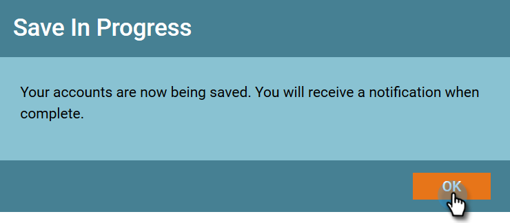

# Nieuwe accountdetectie {#new-account-discovery}

De Nieuwe Ontdekking van de Rekening kan u helpen nieuwe rekeningen vinden om te richten door op AI-Gebaseerde aanbevelingen van uw ideale klantenprofiel te gebruiken.

>[!IMPORTANT]
>
>Accountprofilering is vanaf 2025 niet meer beschikbaar voor nieuwe gebruikers. Het zal voor bestaande gebruikers blijven werken.

>[!PREREQUISITES]
>
>[&#x200B; Profilering van de Rekening van de opstelling &#x200B;](/help/marketo/product-docs/target-account-management/account-profiling/setting-up-account-profiling.md)

>[!TIP]
>
>Het wordt geadviseerd om de **Update Bestaande Rekeningen** knoop te drukken alvorens een nieuw rekeningsonderzoek uit te voeren om u te verzekeren bekijkt de meest recente gegevens. Deze update kan maximaal 24 uur in beslag nemen.

1. Klik in Mijn Marketo op **[!UICONTROL Target Account Management]** .

   

1. Klik op de tab **[!UICONTROL Account Profiling]** .

   

1. Klik op de tab **[!UICONTROL New Accounts]** .

   

   >[!NOTE]
   >
   >[!UICONTROL New Accounts] geeft een lijst weer met accounts die nog niet van u zijn in TAM. Het zijn accounts die mogelijk nieuw voor u zijn op basis van filters die u selecteert.

1. Selecteer alle toepasselijke filters (dit deel is hoogst aanpasbaar, het volgende is enkel één voorbeeld om het filtreren aan te tonen).

   

1. Klik op **[!UICONTROL Save All & Create List]** rechtsonder op de pagina.

   

   >[!NOTE]
   >
   >Als u slechts een paar rekeningen ziet u wilt, hebt u de optie om op individuele rekeningen te klikken en **te klikken sparen Geselecteerde Rekeningen** wanneer gedaan.

1. Je kunt een lijst maken met je eigen nieuwe account of deze toevoegen aan een bestaande lijst. In dit voorbeeld maken we een nieuwe.

   

   >[!NOTE]
   >
   >Als u de account wilt opslaan in een bestaande accountlijst, selecteert u die optie, klikt u op de vervolgkeuzelijst en selecteert u de gewenste accountlijst en klikt u op **[!UICONTROL Next]** .

1. Klik op **[!UICONTROL Save]**.

   

   >[!NOTE]
   >
   >U kunt maximaal 5.000 accounts tegelijk opslaan. Als uw zoekopdracht 10.000 resultaten oplevert, moet u de eerste (bovenste) 5.000 opslaan, vervolgens de filters herstellen en de volgende 5.000 opslaan. De **totale** rekeningsgrens is één miljoen.

1. Klik op **[!UICONTROL OK]**.

   

   >[!TIP]
   >
   >Nadat uw rekeningen worden bewaard, kunt u a [&#x200B; aangepast publiek op  [!DNL LinkedIn]](/help/marketo/product-docs/target-account-management/target/create-an-account-matched-audience-on-linkedin.md) gebruiken om hen te richten.
