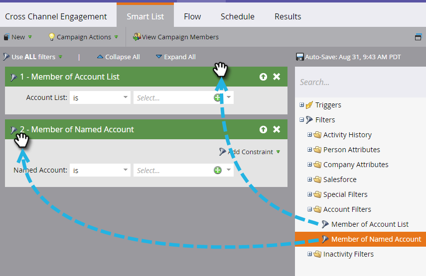

# [!UICONTROL Account Filters] {#account-filters}

Benoemde accounts en de personen binnen deze accounts identificeren en inschakelen met behulp van nieuwe op account gerichte filters.

## TAM-filters {#tam-filters}

1. Selecteer uw slimme campagne en klik op **[!UICONTROL Smart List]** .

   

1. Klik op **+** om de map **[!UICONTROL Account Filters]** uit te vouwen.

   

1. Sleep de gewenste filters naar het canvas.

   

## [!UICONTROL Member of Account List] {#member-of-account-list}

Klik op de vervolgkeuzelijst **[!UICONTROL Account List]** om dit filter te gebruiken...

...en kies uw gewenste accountlijst(en).

>[!NOTE]
>
>Voor het filter [!UICONTROL Member of Account List] is er slechts één kwalificatie: &quot;[!UICONTROL is]&quot; - Aanvullende aanduidingen (zoals &quot;is not&quot; en &quot;is any&quot;) zijn niet beschikbaar.

## [!UICONTROL Member of Named Account] {#member-of-named-account}

Kies eerst een kwalificatie. **[!UICONTROL is]** voor een specifieke benoemde account(s) of **[!UICONTROL is any]** voor een benoemde account.

Klik op de vervolgkeuzelijst benoemde account...

...en kies de gewenste benoemde account(s).

Als u &quot;[!UICONTROL is any]&quot;bepalend gebruikt, kunt u [ beperkingen ](/help/marketo/product-docs/core-marketo-concepts/smart-lists-and-static-lists/using-smart-lists/add-a-constraint-to-a-smart-list-filter.md) willen gebruiken om uw onderzoeksresultaten te beperken. Voeg zoveel toe als u wilt!

Stel &quot;[!UICONTROL Include Children]&quot; in op **[!UICONTROL false]** als u alleen leden van het enkelvoudige account op hoofdniveau wilt. Selecteer **[!UICONTROL true]** als u leden van alle onderliggende accounts wilt.

>[!MORELIKETHIS]
>
>[ Trekkers van de Rekening ](/help/marketo/product-docs/target-account-management/engage/account-triggers.md)
