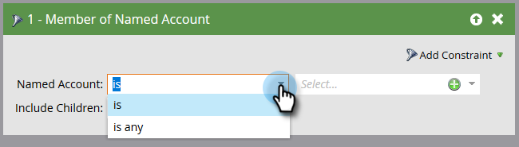

# Accountfilters {#account-filters}

Benoemde accounts en de personen binnen deze accounts identificeren en inschakelen met behulp van nieuwe op account gerichte filters.

## TAM-filters {#tam-filters}

1. Selecteer uw slimme campagne en klik **Slimme Lijst**.

   

1. Klik op **+** om de map **Accountfilters** uit te vouwen.

   

1. Sleep de gewenste filters naar het canvas.

   

## Lid van de Lijst van Rekening {#member-of-account-list}

Klik op de vervolgkeuzelijst met accounts om dit filter te gebruiken...

...en kies de gewenste accountlijst(en).

>[!NOTE]
>
>Voor het filter Account List is er slechts één kwalificatie: &quot;is&quot; - Aanvullende aanduidingen (zoals &quot;is not&quot; en &quot;is any&quot;) zijn niet beschikbaar.

## Lid van benoemde rekening {#member-of-named-account}

Kies eerst een kwalificatie. **** Isfor a specific named account(s) or  **is** any for any named account.

Klik op de vervolgkeuzelijst benoemde account...

...en kiest u de gewenste benoemde account(s).

Als u &quot;is om het even welk&quot;bepalend gebruikt, kunt u [beperkingen ](/help/marketo/product-docs/core-marketo-concepts/smart-lists-and-static-lists/using-smart-lists/add-a-constraint-to-a-smart-list-filter.md) willen gebruiken om uw onderzoeksresultaten te beperken. Voeg zoveel toe als u wilt!

Stel &#39;Onderliggende niveaus opnemen&#39; in op false als u alleen leden van het enkelvoudige, bovenste account wilt opnemen. Selecteer waar als u leden van alle kindrekeningen wilt.

>[!MORELIKETHIS]
>
>[Accounttriggers](/help/marketo/product-docs/target-account-management/engage/account-triggers.md)
